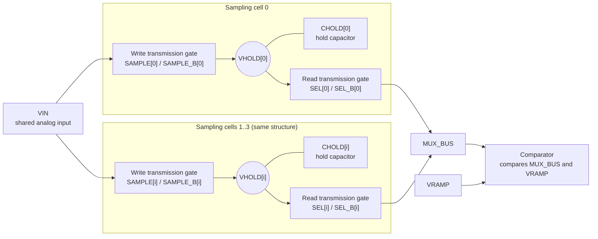
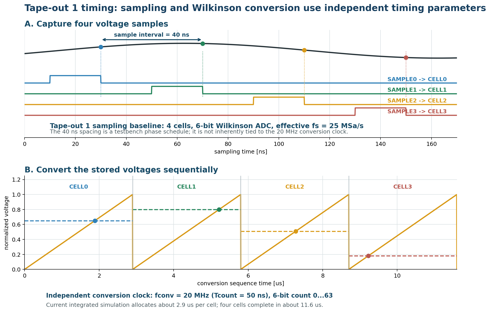

# Waveform-Sampling ASIC Prototype Specification

Version: 0.4 (controlled baseline)

Date: 2026-08-31

Process baseline: GF180MCU (`gf180mcuD`)

MPW provider: **wafer.space GF180MCU Run 3**

Submission baseline: clean GDS by 2026-12-16 11:59 PM AoE; reconfirm before purchase

Status: architecture, provider, PDK commit, 3.3 V library set, nominal
supplies, and slot power topology frozen. The `0.5x1` COB ring with a second
core supply pair passed the provider platform's CoB precheck (2026-08-31);
ESD is handled by design rule because the provider issues no written
acceptance. The slot purchase (early-bird 2026-09-30) remains open.

Language: **English** | [日本語版](PROTOTYPE_SPECIFICATION_JP.md)

## 1. Purpose and document control

This is the controlled specification shared by the project for Tape-out 1.
The first priority is a reproducible demonstration of the complete flow from
specification and schematic through simulation, layout, signoff, fabrication,
and measurement. Maximum performance is not the primary acceptance criterion.

The laboratory procedure is in
[`lecture/ASIC_Lab_Handbook_EN.md`](lecture/ASIC_Lab_Handbook_EN.md), current
verification status is in [`VERIFICATION_MATRIX.md`](VERIFICATION_MATRIX.md),
and unfinished tape-out work is tracked in
[`TAPEOUT_BLOCKERS.md`](TAPEOUT_BLOCKERS.md).
Provider rationale and published slot constraints are recorded in
[`decisions/0004-wafer-space-run3.md`](decisions/0004-wafer-space-run3.md).
The controlled technology/library choices and provider questions are in
[`PDK_PAD_SUPPLY_FREEZE.md`](PDK_PAD_SUPPLY_FREEZE.md).

- **Must**: required for Tape-out 1 unless an explicit waiver or scope revision is approved.
- **Target**: an objective whose miss does not by itself invalidate the flow demonstration.
- **Stretch**: attempted only when it does not endanger Must requirements.
- **Demonstrated**: reproducible pre-layout evidence exists in the repository.
- **TBD**: requires an external MPW, PDK, pad, package, or physical-design decision.

## 2. Relationship to the proposal

The proposal begins with a one-channel proof of concept. The longer-term
IRSX-equivalent objective is eight channels with multi-GSa/s sampling,
approximately 25 ps timing, 500 MHz analog bandwidth, a 12-bit Wilkinson ADC,
and FPGA readout. These longer-term capabilities are not Tape-out 1 pass/fail
criteria.

Tape-out 1 retains the waveform-sampling and Wilkinson-conversion signal path
at deliberately reduced scale:

```text
1 analog channel
-> 4 sampling cells
-> 4-to-1 analog MUX
-> shared ramp + comparator
-> 6-bit counter capture
-> four 6-bit registers
-> 24-bit synchronous serial readout
```

## 3. Tape-out 1 success definition

Tape-out 1 shall demonstrate this complete chain:

```text
specification
-> schematic
-> pre-layout simulation
-> layout
-> DRC / LVS
-> PEX / post-layout simulation
-> analog + digital top integration
-> pad ring / package / PCB
-> clean-GDS submission to wafer.space GF180MCU Run 3
-> first-silicon measurement
```

Silicon success includes either correct 4-cell/6-bit operation or conclusive
fault isolation through the required test modes. Achieving 12 bits, 1 GSa/s,
or 500 MHz is not required for Tape-out 1.

## 4. Three-stage development plan and circuit architecture

`[x]` marks the current formal design baseline. `[ ]` marks a future stage whose
values must be re-frozen after measuring the preceding silicon.

| Stage | Selected now | Purpose | Channels | Cells/ch | ADC | Sampling target | Main additions |
| --- | --- | --- | --- | --- | --- | --- | --- |
| Tape-out 1 | [x] | Demonstrate the complete flow | 1 | 4 | 6 bit | 25 MSa/s baseline | External clocks, extensive test access |
| Tape-out 2 | [ ] | Increase depth and characterize variation | 1 | 32-128 | 8-10 bit | 100-500 MSa/s target | PVT/mismatch, cell calibration, faster timing generation |
| Tape-out 3 | [ ] | Approach the IRSX-level research objective | 8 | 128 or more, TBD | 12-bit target | 1 GSa/s or more target | Multi-channel front end, timing/voltage calibration |

The following Tape-out 1 choices are frozen unless this specification is
formally revised.

| Item | Status | Tape-out 1 baseline |
| --- | --- | --- |
| MPW provider | [x] | wafer.space GF180MCU Run 3 |
| Schedule | [x] published / [ ] reconfirm | Clean GDS 2026-12-16; parts Q2 2027 |
| Provider template | [x] | Commit `0de7e394337a1f7f5303ac7a3681bf2481b58176` |
| Process | [x] | `gf180mcuD`, PDK/Ciel commit `f6eeac7dad085ffcc829ccfd721f7b4ce39edcf7` |
| Analog devices/supply | [x] | 3.3 V devices; `AVDD=3.3 V`, `AVSS=0 V` |
| Digital cells/supply | [x] | `gf180mcu_as_sc_mcu7t3v3`; `DVDD_CORE=3.3 V` |
| Pad library/I/O supply | [x] platform precheck passed | `gf180mcu_ocd_io`; `IOVDD=3.3 V`. No written provider acceptance exists; the platform's automated checks are the authority |
| ESD | [x] design rule | Selected-library structures only (`asig` pads: HBM diodes to DVDD/DVSS, no buffer). Local CDM secondary protection (diode perimeter > 25 um, series poly R > 50 ohm) at every gate-connected pad. No provider characterization will be issued |
| Slot/package | [x] | `0.5x1` default pad ring plus COB, with the `bidir[43:42]` positions re-typed as a second core `vdd/vss` pair for `AVDD`; passed the platform CoB precheck 2026-08-31 |
| Published pad budget | [x] | 56 signal I/Os including 6 analog, plus 16 power pads; Run 1 COB pinout published (run-specific, watch for a Run 3 revision) |
| Analog channels | [x] | 1 |
| Storage | [x] | Four sampling cells, one hold capacitor per cell |
| Sampling switch | [x] | Transmission gate |
| Hold capacitor | [x] | 1 pF simulation baseline; final PDK device after layout study |
| Read MUX | [x] | 4-to-1 transmission-gate analog MUX |
| ADC | [x] | One shared Wilkinson ramp/comparator path |
| Counter and storage | [x] | 6-bit Gray-safe capture and four 6-bit result registers |
| Readout | [x] | 24-bit slow synchronous CMOS serial output |
| Ramp | [x] | Internal ramp plus external debug/bypass path |
| Clocking | [x] | Board-controllable sampling controls and independent 20 MHz conversion clock |
| Test access | [x] | Block isolation and observable internal nodes, subject to pad budget |

Cell count, ADC width, payload format, clock-domain boundary, and analog/digital
interfaces are frozen. Changing any of them requires a specification revision
and full regression.

## 5. Functional requirements

### 5.1 Sampling and hold

`VIN` is connected to `VHOLD[i]` through a transmission gate while
`SAMPLE[i]` is active. `CHOLD[i]` retains the sampled voltage after opening.



`VHOLD[i]` names an electrical node; `CHOLD[i]` names the physical capacitor
from that node to ground. Ideally, `VHOLD[i]` equals `VIN` when the write switch
opens, and `CHOLD[i]` preserves that voltage as stored charge.

| Name | Type | Function |
| --- | --- | --- |
| `VIN` | Analog voltage | Continuous input shared by four cells |
| `SAMPLE[i]` / `SAMPLE_B[i]` | Complementary digital control | Opens or closes the cell-i write switch |
| `VHOLD[i]` | Analog node voltage | Sampled voltage currently stored by cell i |
| `CHOLD[i]` | Physical capacitor | Temporarily stores charge at `VHOLD[i]` |
| `SEL[i]` / `SEL_B[i]` | Complementary one-hot control | Connects only cell i to `MUX_BUS` |
| `MUX_BUS` | Analog voltage | Carries the selected stored voltage to the comparator |

Must requirements:

- Four cells capture distinguishable input values in the intended order.
- Each cell has explicit complementary switch control.
- Acquisition error, edge disturbance, and hold droop have defined measurements.
- Non-selected cells are not unintentionally overwritten.

The nominal regression stimuli are approximately 0.5, 0.8, 1.1, and 1.4 V.
They are not guaranteed silicon input limits.

### 5.2 Analog selection

A one-hot transmission-gate MUX connects one stored value to `MUX_BUS`.

The MUX does not combine four voltages; it selects **exactly one conversion
input**. When `SEL[2]=1`, only `VHOLD[2]` connects to `MUX_BUS`, while the other
cells remain high impedance. This lets four cells share one ramp, comparator,
and counter, reducing area at the cost of sequential conversion time and
possible read disturbance.

| Phase | `SAMPLE[i]` | `SEL[i]` | `VHOLD[i]` / `MUX_BUS` state |
| --- | --- | --- | --- |
| Track | 1 | 0 | `VHOLD[i]` follows `VIN`; disconnected from MUX |
| Hold | 0 | 0 | `CHOLD[i]` stores voltage; disconnected from MUX |
| Convert cell i | 0 | Only cell i is 1 | `VHOLD[i]` drives `MUX_BUS` for ramp comparison |
| Bus reset | 0 | All 0 | All cells disconnect while the bus returns to a known state |

- No more than one `SEL[i]` is active during conversion.
- A defined bus-reset interval separates cells.
- MUX settling completes before ramp release.
- Disturbance of the source hold capacitor is measured.

### 5.3 Wilkinson conversion

The ramp is reset, one cell is selected, and the counter starts. The comparator
captures the count when `VRAMP` crosses `MUX_BUS`.

```text
ideal_code = floor(crossing_time / conversion_clock_period)
code range = 0 ... 63
```

- Higher held voltage produces a later crossing and non-decreasing code.
- Four conversions complete without loss of cell order.
- Comparator polarity and capture convention are documented.
- A conversion timeout handles no-crossing cases.

The current nominal integrated signature is `16, 20, 27, 35`. It is a
regression result, not an INL/DNL guarantee.

### 5.4 Digital capture and readout

The controller sequence is:

```text
IDLE -> RESET_RAMP -> SELECT -> CONVERT -> CAPTURE -> NEXT -> DONE
```

- Gray-coded count capture is used at the asynchronous comparator boundary.
- Four 6-bit results remain associated with their cell numbers.
- The 24-bit payload is `{cell3, cell2, cell1, cell0}` unless explicitly revised.
- Serial bit order, active edge, frame start, and data-valid timing are documented.
- Reset, timeout, and phase-boundary cases have self-checking tests.

### 5.5 Sampling timing and conversion timing

The current four-cell testbench begins the four track pulses at 10, 50, 90,
and 130 ns. The 40 ns spacing corresponds to a 25 MSa/s aggregate sampling
rate. Each track pulse is 20 ns wide in this baseline.

The 40 ns spacing is a testbench phase schedule. It is not derived from the
20 MHz conversion clock. A later sequencer could advance one cell per cycle of
a 25 MHz sampling-system clock, but that clock-generation architecture is not
yet frozen.

The conversion clock is an independent parameter. At the present 20 MHz
baseline, `TCOUNT = 50 ns`; one sequential conversion takes about 2.9 us and
four conversions take about 11.6 us. Tape-out 1 therefore captures one short
four-sample record and converts it afterward. It is not a continuous dead-time-
free sampler.



*Figure: A 5 MHz example input sampled every 40 ns by four cells, followed by
sequential 6-bit Wilkinson conversion using an independent 20 MHz clock.*

## 6. Provisional electrical specifications by development stage

The electrical targets and circuit architecture refer to the same three
Tape-out stages. Provider-qualified limits always override this table.

| Item | Tape-out 1 [x] | Tape-out 2 [ ] | Tape-out 3 [ ] |
| --- | --- | --- | --- |
| Channels | 1 | 1 | 8 |
| Cells/channel | 4 | 32-128 | 128 or more, TBD |
| Sampling interval | 40 ns baseline | 2-10 ns target | 1 ns or less target |
| Sampling rate | 25 MSa/s baseline | 100-500 MSa/s target | 1 GSa/s or more target |
| Record window | 120 ns first-to-last; 160 ns as four-sample depth | Determined by depth and rate | Determined by depth and rate |
| Analog input | 0.4-1.6 V simulation baseline | Re-freeze after first-silicon measurements | Re-freeze with front end |
| Analog bandwidth | DC/low frequency required; 10 MHz measurement target | 50-200 MHz target | 500 MHz target |
| ADC | 6-bit Wilkinson | 8-10 bit Wilkinson | 12-bit Wilkinson target |
| Conversion clock | Independent 20 MHz baseline | 20-100 MHz candidate | Redesign architecture and parallelism |
| Conversion/readout | Four cells sequentially in about 11.6 us | Add parallelism for deeper arrays | Support eight-channel throughput |
| Power | Measure analog/digital separately; target below 50 mW excluding I/O | Budget from silicon data | Define system power budget |
| Calibration | Pedestal and transfer measurement | Per-cell time/voltage calibration | Eight-channel system calibration |

No value is a silicon guarantee until PVT, mismatch, PEX, package effects, and
measurement uncertainty are included.

## 7. Required implementation and observability

### 7.1 Analog blocks

- Four transmission-gate sampling cells and hold capacitors.
- 4-to-1 analog MUX and bus reset.
- Ramp generator, reset device, bias, and monitor.
- Comparator and output buffer.
- External ramp injection or bypass.
- Required analog biasing and supply decoupling.

### 7.2 Digital blocks

- 6-bit counter and Gray-coded asynchronous capture.
- Four-cell conversion controller.
- Four 6-bit result registers.
- 24-bit synchronous serial readout.
- Reset, test mode, timeout, and status logic.

### 7.3 Mandatory test access

Subject to the final pad budget, the top shall provide:

- Direct or buffered observation of at least one `VHOLD` node.
- External ramp input and buffered internal-ramp monitor.
- Comparator standalone mode and digital output observation.
- Conversion-clock input and divided-clock/status monitor.
- Digital test mode independent of the analog crossing.
- Access to all captured codes.
- Separately measurable analog-core (`AVDD`), digital-core, and I/O supply
  currents on the VDD side. All grounds are common on the default COB
  breakout, so ground currents are not separable.
- At least one replica MOS/capacitor characterization structure.

Test access takes priority over additional depth, resolution, or serializer
complexity.

## 8. Verification requirements

### 8.1 Analog

Every analog block included in silicon requires a readable Xschem schematic or
controlled SPICE source, automated nominal measurements, applicable DC/AC/
transient tests, PVT corners, mismatch analysis for sensitive blocks, DRC/LVS
clean layout, and extracted post-layout verification.

```sh
make analog-regression
```

### 8.2 Digital and mixed signal

Every RTL block requires self-checking simulation, GF180 synthesis, timing
analysis, and boundary tests. Measured SPICE crossing times shall drive the
real capture RTL, including conversion-clock phase sweeps.

```sh
make course-regression
```

### 8.3 Physical and top-level signoff

```text
schematic simulation
-> layout
-> DRC
-> extraction
-> LVS
-> PEX simulation
```

LVS proves connectivity, not analog performance. PEX shall repeat sampling
error, hold disturbance, ramp slope/linearity, comparator delay/offset, and
integrated conversion measurements.

The full chip also requires qualified pad/ESD cells, power/substrate review,
analog macro integration, DRC/LVS/antenna/density/ERC/provider checks, and a
clean-checkout build using pinned tools and PDK data.

## 9. Silicon acceptance

Follow [`SILICON_TEST_PROCEDURE.md`](SILICON_TEST_PROCEDURE.md) for power
sequencing, stop conditions, block tests, integrated conversion, and ADC/speed/
bandwidth characterization.

Tape-out 1 is a complete-flow success when these are demonstrated or a failure
is conclusively isolated through test access:

1. Safe power-up and measurable analog/digital currents.
2. Functional reset, clocks, status, and serial communication.
3. Acquisition and hold of a DC or low-frequency input by at least one cell.
4. Observable comparator crossing with the external ramp.
5. Counter capture and bit-correct serial readout.
6. A measurable multi-point transfer curve.
7. Four samples associated with the correct cell addresses.
8. Internal-ramp behavior compared with the external reference.
9. Publication of measurements, failures, calibration, and pre-silicon comparison.

## 10. Explicit non-goals for Tape-out 1

- Multi-GSa/s operation or 25 ps timing resolution.
- Validated 500 MHz analog bandwidth.
- Guaranteed 8-, 10-, or 12-bit ADC performance.
- A 32-, 128-, or 512-cell array or IRSX-level eight-channel integration.
- DLL-locked timing, production PMT front end, or high-speed I/O.
- Radiation or production reliability qualification.

## 11. Freeze gates

### Gate A: External constraints

Confirm MPW run/date, die area, PDK revision, supplies, I/O cells,
package/COB option, pad template, and provider deliverables. The provider
issues no written confirmations; the authority is the automated precheck and
CoB checks on platform.wafer.space (see
[`PDK_PAD_SUPPLY_FREEZE.md`](PDK_PAD_SUPPLY_FREEZE.md)). Technical items
closed 2026-08-31; the slot purchase closes the gate.

### Gate B: Schematic

The 4-cell/6-bit architecture passes `make course-regression`; PVT/mismatch
criteria, interfaces, test modes, timeout, payload, area, power, and pad budgets
are reviewed.

### Gate C: Block layout

Analog and digital blocks are DRC/LVS clean, extracted critical simulations
pass or have reviewed waivers, and macro interfaces are frozen.

### Gate D: Full chip

Pads, power, macros, test structures, fill, and seal-ring constraints are
integrated; full-chip signoff passes; ASIC pinout, bond map, PCB, and FPGA
interface agree.

### Gate E: Release

Provider checklist and clean-clone build pass. GDS/OASIS, netlists, reports,
waivers, checksums, Git tag, and measurement plan are archived.

## 12. Open external decisions

The internal architecture is frozen at four cells and six bits. Remaining
decisions are:

Resolved 2026-08-31 (details in
[`PDK_PAD_SUPPLY_FREEZE.md`](PDK_PAD_SUPPLY_FREEZE.md)): the `0.5x1`
default-ring COB slot is frozen; PDK/template commits match the public
template pin; the 3.3 V library set and I/O cells passed the platform
precheck (no written acceptance exists); analog-pad ESD is handled by design
rule; `AVDD` is separated through a second core supply pair while all grounds
are common; packaging is COB.

1. Purchase the Run 3 slot (early-bird 2026-09-30, purchase deadline
   2026-12-09); re-verify the PDK/template pins at purchase and before
   submission.
2. Final capacitor type/value after leakage, area, and PEX study.
3. Final comparator variant after PVT/mismatch/post-layout comparison.
4. Ramp ranges and monitor implementation.
5. Formal silicon sampling and conversion-clock limits.
6. Evaluation PCB (mating the provider's COB mezzanine), FPGA, connectors,
   and I/O voltage levels.

## 13. Change control

Changes to interfaces, cell count, ADC width, payload, pads, supplies,
reliability, or a Must requirement require a version/date update, written
impact assessment, updates to tests/matrix/Handbook/decision records, and full
regression. Parameter tuning may proceed without an architecture revision only
when interfaces, reliability limits, and Must behavior remain unchanged.
