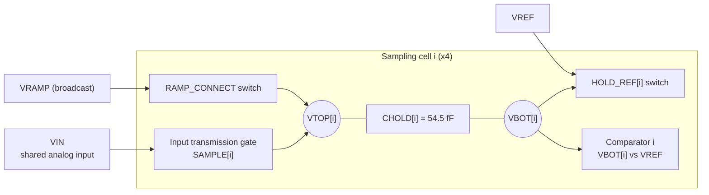
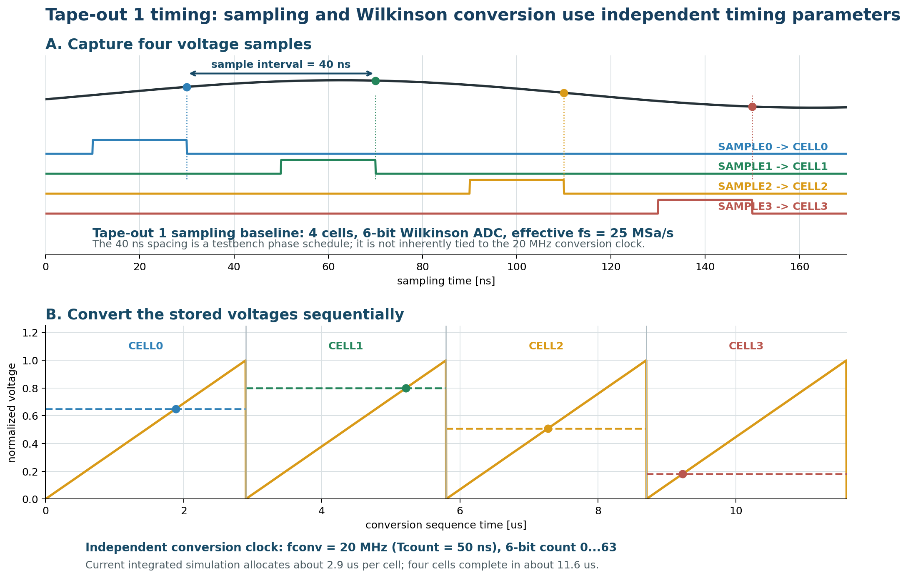

# Waveform-Sampling ASIC Prototype Specification

Version: 0.6-draft (controlled baseline; architecture revision of 2026-09-18 under review)

Date: 2026-09-18

Process baseline: GF180MCU (`gf180mcuD`)

MPW provider: **wafer.space GF180MCU Run 3**

Submission baseline: clean GDS by 2026-12-16 11:59 PM AoE; reconfirm before purchase

Status: provider, PDK commit, 3.3 V library set, nominal supplies, and slot
power topology frozen. **Architecture revised 2026-09-18** (design review with
the collaborating IC-design group): the 4-to-1 analog MUX is removed, every
storage cell has its own comparator and all four cells convert in parallel;
the hold capacitor is the smallest drawable MIM (54.5 fF); sampling is
bottom-plate with the ramp applied to the capacitor so the comparators trip
at a fixed reference; the ADC is 8 bit. The RTL, its tests, and the first
transistor-level cell study on this repository already follow the revision;
the analog block schematics/layouts are being re-derived. The `0.5x1` COB ring with a second
core supply pair passed the provider platform's CoB precheck (2026-08-31);
ESD is handled by design rule because the provider issues no written
acceptance. **Slot changed 2026-10-02 to `1x0.5`** (the others sold out; ADR 0004 addendum): die 3.932 x 2.531 mm, 4 analog pads, second core pair at `bidir[45:44]`; purchase deadline 2026-12-09.

Language: **English** | [日本語版](PROTOTYPE_SPECIFICATION_JP.md)

## 1. Purpose and document control

This is the controlled specification shared by the project for Tape-out 1.
The first priority is a reproducible demonstration of the complete flow from
specification and schematic through simulation, layout, signoff, fabrication,
and measurement. Maximum performance is not the primary acceptance criterion.

The laboratory procedure is in
[`lecture/ASIC_Lab_Handbook_EN.md`](lecture/ASIC_Lab_Handbook_EN.md), current
verification status is in [`VERIFICATION_MATRIX.md`](VERIFICATION_MATRIX.md),
and unfinished tape-out work is tracked in
[`TAPEOUT_BLOCKERS.md`](TAPEOUT_BLOCKERS.md).
Provider rationale and published slot constraints are recorded in
[`decisions/0004-wafer-space-run3.md`](decisions/0004-wafer-space-run3.md).
The controlled technology/library choices and provider questions are in
[`PDK_PAD_SUPPLY_FREEZE.md`](PDK_PAD_SUPPLY_FREEZE.md).

- **Must**: required for Tape-out 1 unless an explicit waiver or scope revision is approved.
- **Target**: an objective whose miss does not by itself invalidate the flow demonstration.
- **Stretch**: attempted only when it does not endanger Must requirements.
- **Demonstrated**: reproducible pre-layout evidence exists in the repository.
- **TBD**: requires an external MPW, PDK, pad, package, or physical-design decision.

## 2. Relationship to the proposal

The proposal begins with a one-channel proof of concept. The longer-term
IRSX-equivalent objective is eight channels with multi-GSa/s sampling,
approximately 25 ps timing, 500 MHz analog bandwidth, a 12-bit Wilkinson ADC,
and FPGA readout. These longer-term capabilities are not Tape-out 1 pass/fail
criteria.

Tape-out 1 retains the waveform-sampling and Wilkinson-conversion signal path
at deliberately reduced scale:

```text
1 analog channel
-> 4 bottom-plate sampling cells (54.5 fF MIM each)
-> 1 broadcast ramp, 1 comparator per cell (fixed-reference trip)
-> shared 8-bit Gray counter, 4 parallel captures
-> four 8-bit registers
-> 32-bit synchronous serial readout
```

## 3. Tape-out 1 success definition

Tape-out 1 shall demonstrate this complete chain:

```text
specification
-> schematic
-> pre-layout simulation
-> layout
-> DRC / LVS
-> PEX / post-layout simulation
-> analog + digital top integration
-> pad ring / package / PCB
-> clean-GDS submission to wafer.space GF180MCU Run 3
-> first-silicon measurement
```

Silicon success includes either correct 4-cell/8-bit operation or conclusive
fault isolation through the required test modes. Achieving 12 bits, 1 GSa/s,
or 500 MHz is not required for Tape-out 1.

## 4. Three-stage development plan and circuit architecture

`[x]` marks the current formal design baseline. `[ ]` marks a future stage whose
values must be re-frozen after measuring the preceding silicon.

| Stage | Selected now | Purpose | Channels | Cells/ch | ADC | Sampling target | Main additions |
| --- | --- | --- | --- | --- | --- | --- | --- |
| Tape-out 1 | [x] | Demonstrate the complete flow with the scalable cell architecture | 1 | 4 | 8 bit | 25 MSa/s baseline | External clocks, extensive test access |
| Tape-out 2 | [ ] | Increase depth and characterize variation | 1 | 32-128 | 8-10 bit | 100-500 MSa/s target | PVT/mismatch, cell calibration, faster timing generation |
| Tape-out 3 | [ ] | Approach the IRSX-level research objective | 8 | TBD by cell area (see note) | 12-bit target | 1 GSa/s or more target | Multi-channel front end, timing/voltage calibration |

Scale note (2026-09-18): with the first drawn GF180 unit cell (28 x 22 um =
616 um^2 without routing, comparator-dominated) an IRSX-class array of 8 x
32768 cells would need ~160 mm^2 and even one 32768-cell channel ~20 mm^2,
against 12.9 mm^2 of core in the largest provider slot (1x1). The Tape-out 3
depth and channel count must therefore be set from the measured Tape-out 1/2
cell area and from the required *time* depth (trigger latency x sampling
rate), not copied from IRSX; a process/node decision belongs to the
Tape-out 3 gate.

The following Tape-out 1 choices are frozen unless this specification is
formally revised.

| Item | Status | Tape-out 1 baseline |
| --- | --- | --- |
| MPW provider | [x] | wafer.space GF180MCU Run 3 |
| Schedule | [x] published / [ ] reconfirm | Clean GDS 2026-12-16; parts Q2 2027 |
| Provider template | [x] | Commit `0de7e394337a1f7f5303ac7a3681bf2481b58176` |
| Process | [x] | `gf180mcuD`, PDK/Ciel commit `f6eeac7dad085ffcc829ccfd721f7b4ce39edcf7` |
| Analog devices/supply | [x] | 3.3 V devices; `AVDD=3.3 V`, `AVSS=0 V` |
| Digital cells/supply | [x] | `gf180mcu_as_sc_mcu7t3v3`; `DVDD_CORE=3.3 V` |
| Pad library/I/O supply | [x] platform precheck passed | `gf180mcu_ocd_io`; `IOVDD=3.3 V`. No written provider acceptance exists; the platform's automated checks are the authority |
| ESD | [x] design rule | Selected-library structures only (`asig` pads: HBM diodes to DVDD/DVSS, no buffer). Local CDM secondary protection (diode perimeter > 25 um, series poly R > 50 ohm) at every gate-connected pad. No provider characterization will be issued |
| Slot/package | [x] revised 2026-10-02 | **`1x0.5`** default pad ring plus COB (the `0.5x1` ring below is superseded; same approach, second pair at `bidir[45:44]`, platform-verified for `0.5x1` only so far). Previously: `0.5x1` default pad ring plus COB, with the `bidir[43:42]` positions re-typed as a second core `vdd/vss` pair for `AVDD`; passed the platform CoB precheck 2026-08-31 |
| Published pad budget | [x] | 56 signal I/Os including 6 analog, plus 16 power pads; Run 1 COB pinout published (run-specific, watch for a Run 3 revision) |
| Analog channels | [x] | 1 |
| Storage | [x] | Four sampling cells, one hold capacitor and one comparator per cell |
| Sampling switch | [x] | Bottom-plate sampling: the capacitor switch at the fixed reference opens first, the input transmission gate second (2026-09-18) |
| Hold capacitor | [x] | **54.5 fF MIM**, the smallest drawable GF180 MIM (FuseTop 27.2 um^2 once the Via4 rules are met; density 2.007 fF/um^2 extracted). Chosen 2026-09-18 over MOS (bias-dependent `cap_nmos`; the accumulation `cap_nmos_03v3_b` is flat but occupies active area) and MOM (~0.57 fF/um^2, occupies M1-M4 over its whole footprint) because the MIM sits in M4/M5 **above** the comparator and costs no cell area. The 1 pF value of v0.5 was a consequence of the removed shared-bus MUX |
| Read MUX | [x] removed | **None** (2026-09-18). Every cell has its own comparator; one ramp is broadcast to all cells; the four conversions run in parallel (IRSX-style). The v0.5 MUX blocks remain in the repository as legacy reference only |
| ADC | [x] | Wilkinson: one shared ramp and 8-bit Gray counter, one comparator per cell. **Ramp applied to the storage capacitor** (not to the comparator input): the comparator senses the plate that was frozen first and trips at a fixed reference, so its common-mode dependence does not enter the transfer function |
| Input voltage window | [ ] target | 1.5 V span, IRSX-like 0.5-2.0 V as the working assumption. On the 3.3 V supply the window *position* is a free variable set by the front-end baseline; freeze it together with the comparator variant (see below) |
| Comparator input pair | [ ] re-derive | The fixed-reference trip (2026-09-18) removes the requirement of offset accuracy across 0.5-2.0 V; what remains is that the input pair stays functional while the sensed node moves toward the trip point (see 5.3). The PMOS-input choice made for a moving trip point and the ~150 um^2 / ~50 uW sizing are to be re-derived against the new spec (fixed trip near 2.0 V favours an NMOS pair) |
| Counter and storage | [x] | Shared 8-bit Gray counter, four comparator-edge capture channels, four 8-bit result registers, per-cell timeout flag |
| Readout | [x] | 32-bit slow synchronous CMOS serial output `{cell3, cell2, cell1, cell0}` |
| Ramp | [x] | Internal ramp plus external debug/bypass path |
| Clocking | [x] | Board-controllable sampling controls (with the in-cell bottom-first switch order generated on chip) and independent 20 MHz conversion clock |
| Test access | [x] | Block isolation and observable internal nodes, subject to pad budget |

Cell count, ADC width, payload format, clock-domain boundary, and analog/digital
interfaces are frozen. Changing any of them requires a specification revision
and full regression.

## 5. Functional requirements

### 5.1 Sampling and hold (bottom-plate sampling)

Each cell stores its sample on a 54.5 fF capacitor `CHOLD[i]` between two
nodes: `VTOP[i]` (input side) and `VBOT[i]` (reference side). Three switches
per cell:

| Name | Type | Function |
| --- | --- | --- |
| `VIN` | Analog voltage | Continuous input shared by four cells |
| `SAMPLE[i]` / `SAMPLE_B[i]` | Complementary digital control | Input transmission gate `VIN` -> `VTOP[i]` |
| `HOLD_REF[i]` | Digital control | Switch `VBOT[i]` -> `VREF` (fixed potential). **Opens before `SAMPLE[i]`** |
| `RAMP_CONNECT` | Digital control (global) | Switch `VTOP[i]` -> `VRAMP` bus during conversion |
| `VREF` | Analog reference | Constant potential of the reference plate; also the comparator trip reference |
| `VRAMP` | Analog voltage | Broadcast ramp, starts at 0 V |


```mermaid
flowchart LR
    VIN["VIN<br/>shared analog input"]
    subgraph C0["Sampling cell i (x4)"]
      SW["Input transmission gate<br/>SAMPLE[i]"]
      TOP(("VTOP[i]"))
      CAP["CHOLD[i] = 54.5 fF"]
      BOT(("VBOT[i]"))
      HR["HOLD_REF[i] switch"]
      RC["RAMP_CONNECT switch"]
      CMP["Comparator i<br/>VBOT[i] vs VREF"]
      SW --> TOP
      TOP --- CAP
      CAP --- BOT
      BOT --> HR
      RC --> TOP
      BOT --> CMP
    end
    VIN --> SW
    VREF["VREF"] --> HR
    VRAMP["VRAMP (broadcast)"] --> RC
```

| Phase | `SAMPLE[i]` | `HOLD_REF[i]` | `RAMP_CONNECT` | State |
| --- | --- | --- | --- | --- |
| Track | 1 | 1 | 0 | `VTOP[i]` follows `VIN`, `VBOT[i] = VREF` |
| Freeze | 1 | 0 | 0 | Reference plate opened first: its charge is frozen with a **signal-independent** injection (the switch always sits at `VREF`) |
| Hold | 0 | 0 | 0 | Input gate opened; its signal-dependent injection lands on `VTOP[i]`, which is re-driven later and does not enter the result |
| Convert | 0 | 0 | 1 | `VTOP[i]` driven by `VRAMP`; `VBOT[i] = VREF - (VIN - VRAMP) * C/(C+Cp)` rises toward `VREF` |

Why the sensed plate matters (transistor-level study, `make bottom-plate-cell`,
2026-09-18): sensing the frozen plate gives a constant -7.8 mV pedestal
(0.09 mV spread over 0.5-2.0 V), 0.008 LSB linearity, and **-0.02 % gain
error** because input and ramp share the same capacitive divider. Sensing the
input-side plate instead (ramp on the reference plate) leaves 10-23 mV of
signal-dependent pedestal (2-4 LSB) and a +9-10 % parasitic gain error that
would need per-cell calibration. Either order of physical MIM plates may be
used; electrically, the comparator must sense the plate whose switch opened
first.

Must requirements:

- Four cells capture distinguishable input values in the intended order.
- The `HOLD_REF[i]`-before-`SAMPLE[i]` order is generated on chip (fixed
  delay, target 1-3 ns) and observable in simulation.
- Acquisition error, pedestal (mean and input dependence), hold droop, and
  parasitic gain are defined measurements.
- Non-selected cells are not unintentionally overwritten.

The regression stimuli are 0.5, 0.8, 1.1, 1.4, 1.7, and 2.0 V (the working
input window). They are not guaranteed silicon input limits.

### 5.2 Parallel conversion (replaces the analog selection of v0.5)

There is no analog MUX. After the last cell is held, the controller connects
all `VTOP[i]` to `VRAMP` (held at 0 V), waits for settling, then releases the
ramp and starts the shared counter. Each comparator `i` trips when `VBOT[i]`
reaches `VREF`, which happens when `VRAMP ~= VIN_i`. All four conversions run
concurrently and finish within one ramp.

- `RAMP_CONNECT` is common to all cells; no cell-selection signal exists.
- A defined settling interval separates connection and ramp release.
- The ramp bus load is the sum of the connected cells (4 x (54.5 fF + Cp) in
  Tape-out 1); the ramp generator specification includes this load and the
  Tape-out 3 scaling of it.

### 5.3 Wilkinson conversion

```text
ideal_code = floor((t_cross - t_ramp_start) / conversion_clock_period)
code range = 0 ... 255; a cell that never crosses reads 255 with timeout[i] = 1
```

- Higher held voltage produces a later crossing and a non-decreasing code.
- Every comparator trips at the fixed reference `VREF` (nominally 2.0 V); its
  offset is therefore a per-cell constant (pedestal), not a function of the
  input level. During conversion the sensed node moves from
  `VREF - (VIN - 0) * C/(C+Cp)` (as low as ~0.15 V for a 2.0 V sample) up to
  `VREF`; the comparator must remain functional, not accurate, over that swing.
- Comparator polarity and capture convention are documented.
- A conversion timeout handles no-crossing cases.

The regression signature for the digital path is `16, 20, 27, 200`
(parallel), replacing the sequential `16, 20, 27, 35` of v0.5. It is a
regression result, not an INL/DNL guarantee.

### 5.4 Digital capture and readout

The controller sequence is:

```text
IDLE (acquire) -> CONNECT -> CONVERT -> [DRAIN on overflow] -> DONE
```

- One shared 8-bit binary counter with Gray encoding; each cell captures the
  Gray word on its own comparator falling edge (local capture clock) and a
  toggle synchronizer returns the event to the conversion clock domain.
- Four 8-bit results remain associated with their cell numbers; per-cell
  `timeout` flags accompany them.
- The 32-bit payload is `{cell3, cell2, cell1, cell0}` unless explicitly revised.
- Serial bit order (LSB first), active edge, frame start, and data-valid
  timing are documented.
- Reset, timeout, simultaneous-capture, and last-count cases have
  self-checking tests (`make parallel-controller`, `make digital-top`).

### 5.5 Sampling timing and conversion timing

The four track pulses begin at 10, 50, 90, and 130 ns in the testbench
schedule; the 40 ns spacing corresponds to a 25 MSa/s aggregate sampling
rate (the design review of 2026-09-18 also discussed 50 MSa/s; the value
remains a board-controlled parameter for Tape-out 1). Inside each cell the
reference-plate switch opens 1-3 ns before the input gate.

The conversion clock is an independent parameter. At the 20 MHz baseline,
`TCOUNT = 50 ns`; one parallel 8-bit conversion of all four cells takes
256 counts = 12.8 us plus connect/settle overhead. Tape-out 1 therefore
captures one short four-sample record and converts it afterward. It is not a
continuous dead-time-free sampler.



*Figure (v0.5, to be redrawn): the sampling schedule is unchanged; the
conversion is now one parallel 12.8 us ramp instead of four sequential
2.9 us slots.*

## 6. Provisional electrical specifications by development stage

The electrical targets and circuit architecture refer to the same three
Tape-out stages. Provider-qualified limits always override this table.

| Item | Tape-out 1 [x] | Tape-out 2 [ ] | Tape-out 3 [ ] |
| --- | --- | --- | --- |
| Channels | 1 | 1 | 8 |
| Cells/channel | 4 | 32-128 | 128 or more, TBD |
| Sampling interval | 40 ns baseline | 2-10 ns target | 1 ns or less target |
| Sampling rate | 25 MSa/s baseline | 100-500 MSa/s target | 1 GSa/s or more target |
| Record window | 120 ns first-to-last; 160 ns as four-sample depth | Determined by depth and rate | Determined by depth and rate |
| Analog input | 0.5-2.0 V working window (IRSX-like) | Re-freeze after first-silicon measurements | Re-freeze with front end |
| Analog bandwidth | DC/low frequency required; 10 MHz measurement target | 50-200 MHz target | 500 MHz target |
| ADC | 8-bit Wilkinson, comparator per cell | 8-10 bit Wilkinson | 12-bit Wilkinson target |
| Conversion clock | Independent 20 MHz baseline | 20-100 MHz candidate | Redesign architecture and parallelism |
| Conversion/readout | Four cells in parallel, one 12.8 us ramp | Add parallelism for deeper arrays | Support eight-channel throughput |
| Power | Measure analog/digital separately; target below 50 mW excluding I/O | Budget from silicon data | Define system power budget |
| Calibration | Per-cell pedestal (constant comparator offset + reference-switch injection) and transfer measurement | Per-cell time/voltage calibration | Eight-channel system calibration |

No value is a silicon guarantee until PVT, mismatch, PEX, package effects, and
measurement uncertainty are included.

## 7. Required implementation and observability

### 7.1 Analog blocks

- Four bottom-plate sampling cells: input transmission gate, reference-plate
  switch with on-chip bottom-first delay, 54.5 fF MIM, ramp-connect switch.
- Four comparators (fixed-reference trip) with output buffers.
- Ramp generator driving the connected cells, reset device, bias, and monitor.
- `VREF` generation/decoupling or external `VREF` pad.
- External ramp injection or bypass.
- Required analog biasing and supply decoupling.

### 7.2 Digital blocks

- Shared 8-bit counter and four Gray-coded asynchronous capture channels.
- Parallel conversion controller (acquire / connect / convert / drain).
- Four 8-bit result registers and per-cell timeout flags.
- 32-bit synchronous serial readout.
- Reset, test mode, timeout, and status logic.

### 7.3 Mandatory test access

Subject to the final pad budget, the top shall provide:

- Direct or buffered observation of at least one storage node (`VBOT[0]` or `VTOP[0]`).
- External ramp input and buffered internal-ramp monitor.
- Comparator standalone mode and digital output observation.
- Conversion-clock input and divided-clock/status monitor.
- Digital test mode independent of the analog crossing.
- Access to all captured codes.
- Separately measurable analog-core (`AVDD`), digital-core, and I/O supply
  currents on the VDD side. All grounds are common on the default COB
  breakout, so ground currents are not separable.
- At least one replica MOS/capacitor characterization structure.

Test access takes priority over additional depth, resolution, or serializer
complexity.

## 8. Verification requirements

### 8.1 Analog

Every analog block included in silicon requires a readable Xschem schematic or
controlled SPICE source, automated nominal measurements, applicable DC/AC/
transient tests, PVT corners, mismatch analysis for sensitive blocks, DRC/LVS
clean layout, and extracted post-layout verification.

```sh
make analog-regression
```

### 8.2 Digital and mixed signal

Every RTL block requires self-checking simulation, GF180 synthesis, timing
analysis, and boundary tests. Measured SPICE crossing times shall drive the
real capture RTL, including conversion-clock phase sweeps.

```sh
make course-regression
```

### 8.3 Physical and top-level signoff

```text
schematic simulation
-> layout
-> DRC
-> extraction
-> LVS
-> PEX simulation
```

LVS proves connectivity, not analog performance. PEX shall repeat sampling
error, hold disturbance, ramp slope/linearity, comparator delay/offset, and
integrated conversion measurements.

The full chip also requires qualified pad/ESD cells, power/substrate review,
analog macro integration, DRC/LVS/antenna/density/ERC/provider checks, and a
clean-checkout build using pinned tools and PDK data.

## 9. Silicon acceptance

Follow [`SILICON_TEST_PROCEDURE.md`](SILICON_TEST_PROCEDURE.md) for power
sequencing, stop conditions, block tests, integrated conversion, and ADC/speed/
bandwidth characterization.

Tape-out 1 is a complete-flow success when these are demonstrated or a failure
is conclusively isolated through test access:

1. Safe power-up and measurable analog/digital currents.
2. Functional reset, clocks, status, and serial communication.
3. Acquisition and hold of a DC or low-frequency input by at least one cell.
4. Observable comparator crossing with the external ramp.
5. Counter capture and bit-correct serial readout.
6. A measurable multi-point transfer curve.
7. Four samples associated with the correct cell addresses.
8. Internal-ramp behavior compared with the external reference.
9. Publication of measurements, failures, calibration, and pre-silicon comparison.

## 10. Explicit non-goals for Tape-out 1

- Multi-GSa/s operation or 25 ps timing resolution.
- Validated 500 MHz analog bandwidth.
- Guaranteed 8-, 10-, or 12-bit ADC performance.
- A 32-, 128-, or 512-cell array or IRSX-level eight-channel integration.
- DLL-locked timing, production PMT front end, or high-speed I/O.
- Radiation or production reliability qualification.

## 11. Freeze gates

### Gate A: External constraints

Confirm MPW run/date, die area, PDK revision, supplies, I/O cells,
package/COB option, pad template, and provider deliverables. The provider
issues no written confirmations; the authority is the automated precheck and
CoB checks on platform.wafer.space (see
[`PDK_PAD_SUPPLY_FREEZE.md`](PDK_PAD_SUPPLY_FREEZE.md)). Technical items
closed 2026-08-31; the slot purchase closes the gate.

### Gate B: Schematic

The 4-cell/6-bit architecture passes `make course-regression`; PVT/mismatch
criteria, interfaces, test modes, timeout, payload, area, power, and pad budgets
are reviewed.

### Gate C: Block layout

Analog and digital blocks are DRC/LVS clean, extracted critical simulations
pass or have reviewed waivers, and macro interfaces are frozen.

### Gate D: Full chip

Pads, power, macros, test structures, fill, and seal-ring constraints are
integrated; full-chip signoff passes; ASIC pinout, bond map, PCB, and FPGA
interface agree.

### Gate E: Release

Provider checklist and clean-clone build pass. GDS/OASIS, netlists, reports,
waivers, checksums, Git tag, and measurement plan are archived.

## 12. Open external decisions

The internal architecture is frozen at four cells and six bits. Remaining
decisions are:

Resolved 2026-08-31 (details in
[`PDK_PAD_SUPPLY_FREEZE.md`](PDK_PAD_SUPPLY_FREEZE.md)): the `0.5x1`
default-ring COB slot is frozen; PDK/template commits match the public
template pin; the 3.3 V library set and I/O cells passed the platform
precheck (no written acceptance exists); analog-pad ESD is handled by design
rule; `AVDD` is separated through a second core supply pair while all grounds
are common; packaging is COB.

1. Purchase the Run 3 `1x0.5` slot ($6,500 incl. COB; purchase deadline
   2026-12-09); re-verify the PDK/template pins at purchase and before
   submission.
2. Input voltage window position (1.5 V span) and comparator input-pair
   variant, decided together on the widened-window sweep data; then
   PVT/mismatch/post-layout confirmation of the chosen variant.
3. Small-capacitor test structures (50 fF MIM; MOM/MOS ~15 fF) for the
   scaling path, if pad and area budgets allow.
4. Ramp ranges and monitor implementation.
5. Formal silicon sampling and conversion-clock limits.
6. Evaluation PCB (mating the provider's COB mezzanine), FPGA, connectors,
   and I/O voltage levels.

## 13. Change control

Revision log:

- **0.6-draft (2026-09-18)** — architecture revision from the design review:
  analog MUX removed, comparator per cell with parallel conversion,
  54.5 fF MIM hold capacitor, bottom-plate sampling with the ramp applied to
  the capacitor and a fixed comparator reference, 8-bit ADC and 32-bit frame.
  Sensed-plate rule added from the transistor-level study
  (`simulations/gf180_bottom_plate_cell`). RTL (`parallel_wilkinson_controller`,
  `asic_digital_top`) and tests updated; analog blocks to be re-derived.
- 0.5-draft (2026-09-16) — input window 0.5-2.0 V, comparator variant
  framing, capacitor/MUX scaling path.
- 0.4 (2026-08-31) — Gate A closure.


Changes to interfaces, cell count, ADC width, payload, pads, supplies,
reliability, or a Must requirement require a version/date update, written
impact assessment, updates to tests/matrix/Handbook/decision records, and full
regression. Parameter tuning may proceed without an architecture revision only
when interfaces, reliability limits, and Must behavior remain unchanged.
