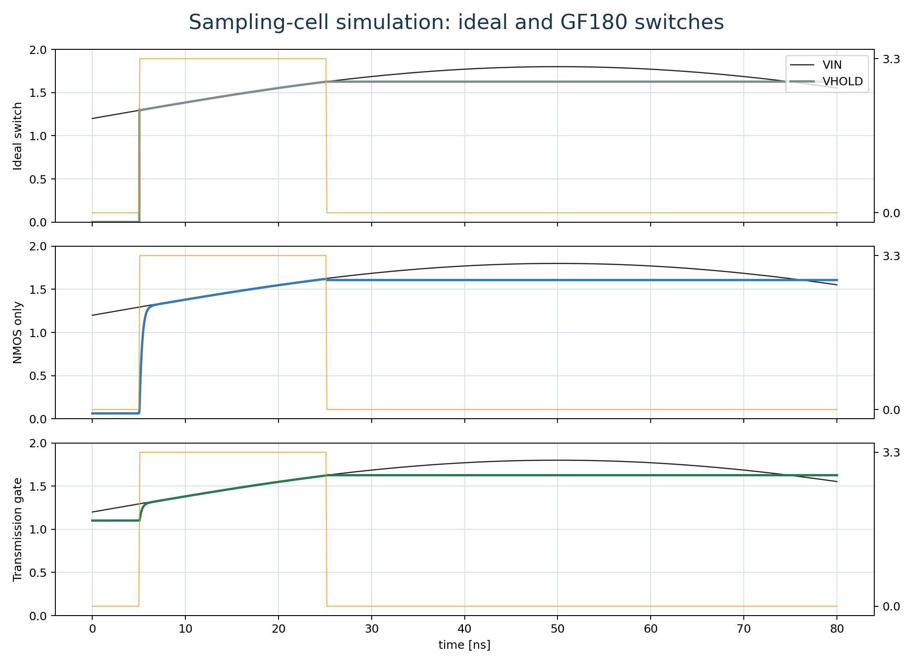
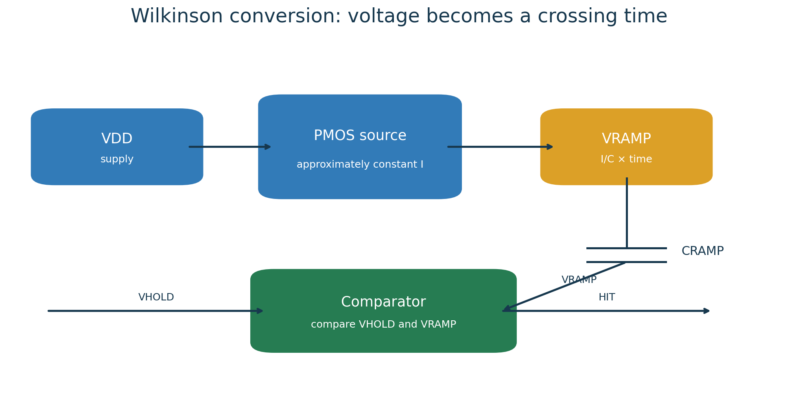
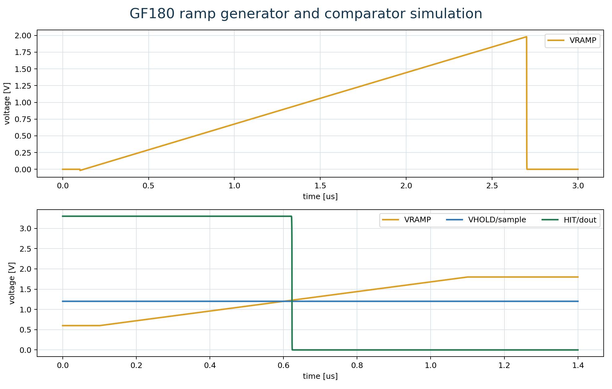
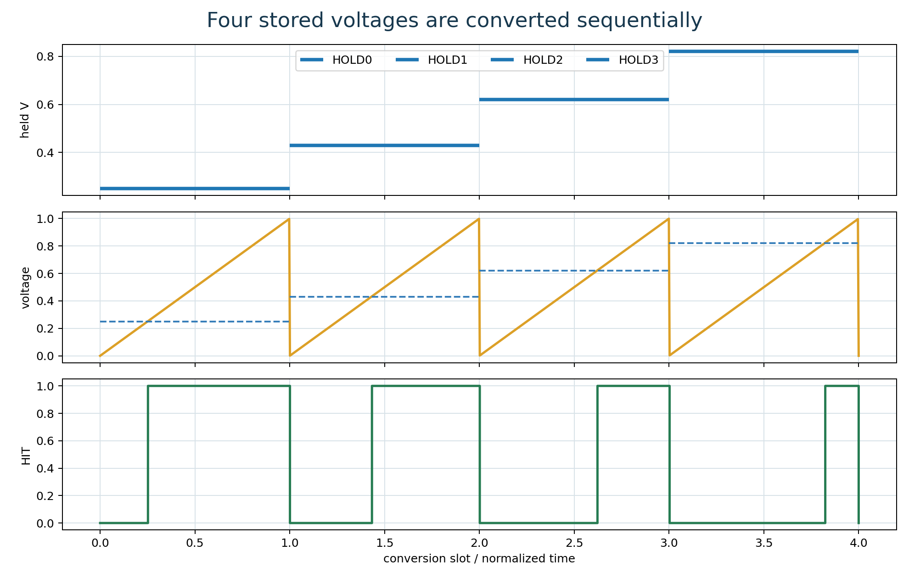
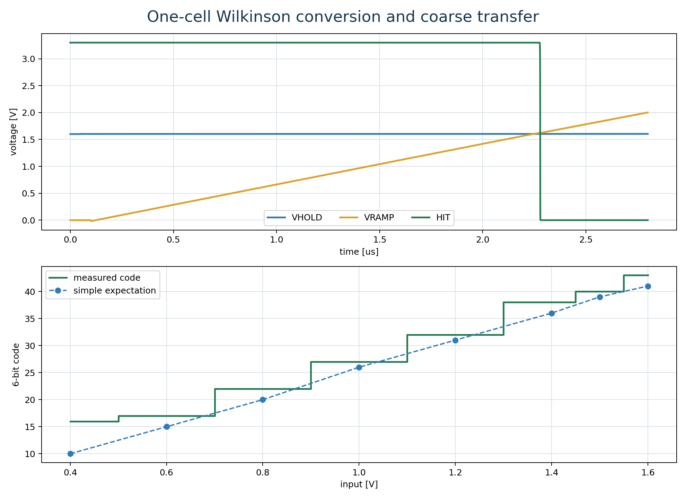
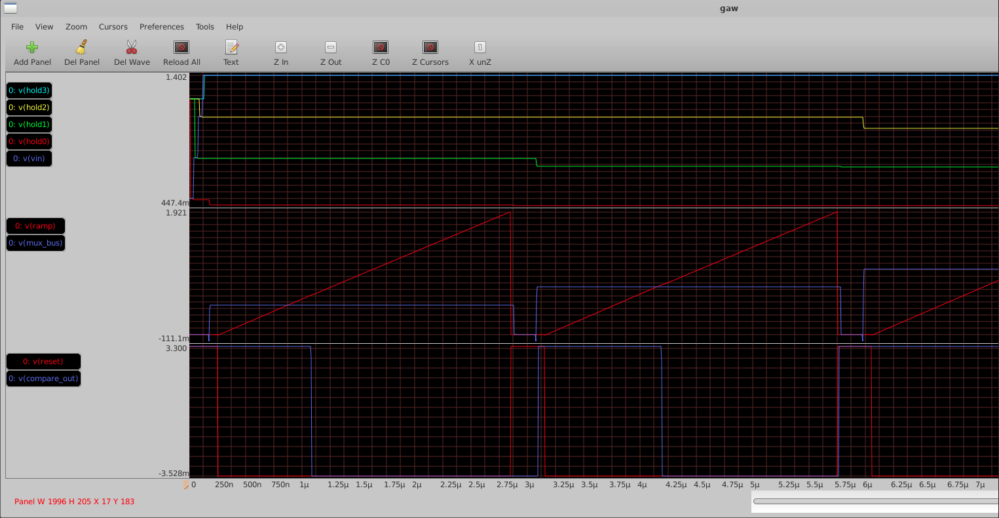
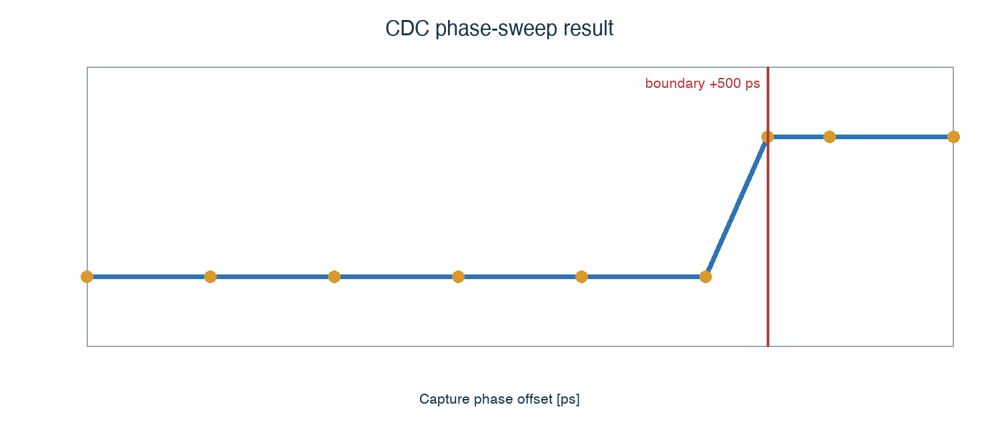
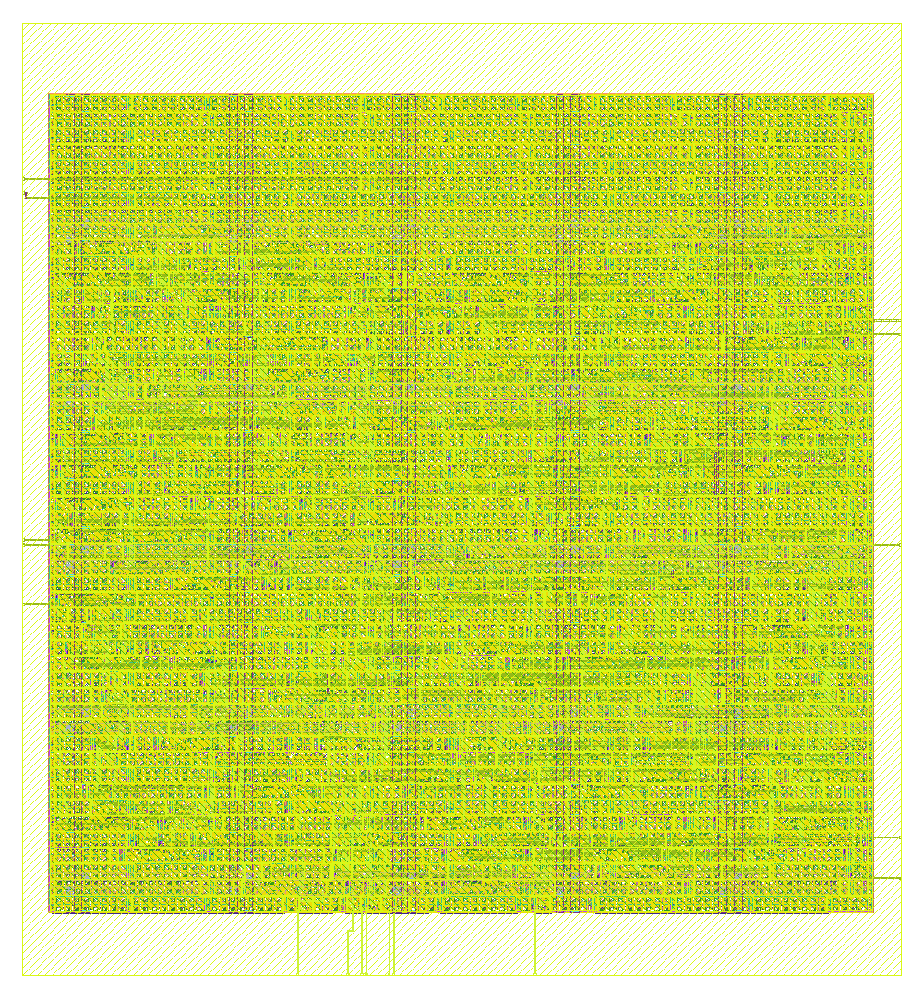

# IRSX-like ASIC 回路設計実習 Workbook

## この教材のゴール

この教材は、ASIC設計が初めての学生が、GF180MCUとopen-source EDAを使って
次の一連の流れを自分で再現できることを目標とする。

```text
仕様 → 回路図 → SPICE → 測定 → RTL → 協調検証 → Layout → DRC/LVS → GDSII
```

最終回路はIRSXと同じ基本原理を持つ小型waveform digitizerである。

```text
VIN → Sampling switch → Hold capacitor → MUX
                                         ↓
                                  Ramp + Comparator
                                         ↓
                                    Counter capture
                                         ↓
                                Register → Serializer
```

本prototypeは1 channel、4 sample、6-bitである。高性能化より、complete design
flowを一度最後まで通し、どの段階で何を証明したか説明できることを優先する。


回路全体を一度に眺めることと、全transistorを一度に検証することは同じではない。
全体接続はblock diagramで確認し、性能は小さいblockから順に積み上げ、最後に統合RAWの
任意nodeをGAWで観測する。この検証の階段を飛ばさないことが重要である。


## 学習の約束

各Labでは必ず次の順序を守る。

1. 回路の目的を一文で書く。
2. 入力、出力、電源、制御信号を列挙する。
3. simulation前に期待波形を手で描く。
4. Xschemまたはsource netlistで接続を確認する。
5. ngspiceを実行する。
6. 波形を時間順に読む。
7. `.measure`の数値を確認する。
8. parameterを一つだけ変更する。
9. 結果を予想と比較する。
10. 元へ戻すか、変更理由をcommitに残す。

## 開発環境

Mac上のDocker DesktopでIIC-OSIC-TOOLS containerを動かす。VNCで見ているのは
container内のLinux desktopであり、Macそのものではない。

```text
Mac filesystem:
/Users/ykeisuke/Desktop/mywork/asic_rd

Container filesystem:
/foss/designs

上記2つはvolume mountで同じrepositoryを見ている。
```

起動:

```sh
cd /Users/ykeisuke/Desktop/mywork/asic_rd
make vnc
```

browser:

```text
http://localhost:8080/?password=abc123
```

## Tool map

| Tool | このprojectでの役割 | 入力 | 出力 |
| --- | --- | --- | --- |
| Xschem | transistor回路図とtestbench | `.sch` | SPICE netlist |
| ngspice | transistor-level simulation | `.spice` | RAW、CSV、measure |
| GAW | RAW波形を自由に観察 | `.raw` | 画面表示 |
| Yosys | RTL synthesis | Verilog | gate netlist |
| Icarus Verilog | RTL testbench | Verilog | log、VCD |
| LibreLane/OpenROAD | digital P&R | netlist、constraints | DEF、GDSII |
| Magic/KLayout | layout、DRC、GDS表示 | layout/GDS | report |
| Netgen | schematic-layout比較 | netlists | LVS report |

# Part I: Analog foundation

## Lab 0: MOS transistorを測定する

### 目的

NMOSのgate voltageがdrain currentを制御することと、GF180 modelを使った
simulationの実行経路を理解する。

### 実行

```sh
make nmos-dc
```

VNCで開く:

```text
/foss/designs/simulations/gf180_nmos_dc/nmos_dc.sch
```

緑矢印`Load simulation results`を`Ctrl + 左クリック`する。GraphにはVGSごとの
Id-Vds curveが現れる。

### 読む順序

1. 横軸がVDS、縦軸がdrain currentであることを確認する。
2. VGSが増えるとcurveが上へ移動することを確認する。
3. 低VDSのほぼ直線部分と、高VDSの飽和領域を区別する。
4. `W`を増やすと電流がほぼ比例して増えることを確認する。

### 合格条件

- NMOSのD、G、S、B端子を説明できる。
- `L`、`W`、`nf`が何を表すか説明できる。
- model fileなしでは実プロセスのMOSをsimulationできない理由を説明できる。

## Lab 1: Sampling switchとHold capacitor

詳細版は
`simulations/gf180_sampling_cell/SAMPLING_CELL_LAB_JP.md`を参照する。

### 目的

連続波形から一時刻の電圧をcapacitorへ保存する。

```text
VIN -- NMOS || PMOS -- VHOLD
                         |
                       CHOLD
                         |
                        GND
```


### 3つの比較対象

```sh
make sampling-cell
```

| 回路 | ファイル | 役割 |
| --- | --- | --- |
| 理想switch | `ideal_sampling_cell.spice` | 誤差測定の基準 |
| NMOS-only | `sampling_cell.spice` | 最小構成 |
| Transmission gate | `transmission_gate.spice` | 採用候補 |



Xschem教材:

```text
/foss/designs/simulations/gf180_sampling_cell/sampling_cell_tg.sch
```

### Xschem操作

1. `sampling_cell_tg.sch`を開く。
2. NMOSとPMOSがVINとVHOLDの間に並列接続されていることを確認する。
3. NMOS gateが`SAMPLE`、PMOS gateが`SAMPLE_B`であることを確認する。
4. `Netlist`を押す。赤色はnetlist生成、緑色はsimulation実行を示す。
5. `Simulate`を押す。
6. 緑矢印を`Ctrl + 左クリック`してRAWを読む。
7. 上段で`VIN`と`VHOLD`、下段で2本のclockを比較する。

### 測定

| 測定 | 意味 | 見る場所 |
| --- | --- | --- |
| acquisition error | track終了直前のVIN−VHOLD | switchが開く直前 |
| edge disturbance | clock edge周辺のVHOLD変化 | TRACK→HOLD境界 |
| hold droop | hold中のVHOLD変化 | flat部分の始点と終点 |

### 演習

- `CHOLD=0.5p, 1p, 2p`を比較する。
- NMOS `W=5u, 10u, 20u`を比較する。
- 一度に複数parameterを変えない。

### 合格条件

- TRACKとHOLDを指し示せる。
- transmission gateを使う理由を説明できる。
- 理想switchにも残る測定窓由来の値と、MOS由来の誤差を区別できる。

## Lab 2: 4-cell sampling array

### 目的

同じ入力波形の異なる時刻を4個のcapacitorへ保存する。

```text
VIN ─┬─ TG0 → HOLD0
     ├─ TG1 → HOLD1
     ├─ TG2 → HOLD2
     └─ TG3 → HOLD3
```

### 実行

```sh
make four-cell
```

観測file:

```text
simulations/gf180_four_cell_array/work/four_cell_array.csv
simulations/gf180_four_cell_array/work/measurements.txt
```

### 読む順序

1. `VIN`が0.5、0.8、1.1、1.4 Vへ変化する。
2. `S0`から`S3`が時間をずらして一度ずつONになる。
3. `HOLD0`から`HOLD3`が対応する電圧を保持する。
4. 4本が順序`HOLD0 < HOLD1 < HOLD2 < HOLD3`を保つ。

### 設計上の注意

cellを増やすとVIN busへ各switchの寄生容量が加わる。理想的にcellをコピーできても、
入力帯域は同じままではない。この問題が深いSCAの主要課題である。

### 演習

- sampling pulseを5 nsずつ前後へ動かす。
- VINが変化している途中でsamplingすると何が保存されるか確認する。
- 4個のCHOLDのうち1個だけを2 pFにしてsettling差を見る。

## Lab 3: Analog MUX

### 目的

4個の保持電圧から1個を選び、共有comparatorへ送る。

```text
HOLD0 ─ TG ┐
HOLD1 ─ TG ├─ VMUX
HOLD2 ─ TG ┤
HOLD3 ─ TG ┘
```

### 実行

```sh
make four-cell-mux
```

### 観測点

- `hold0`から`hold3`: MUX入力
- `sel0`から`sel3`: one-hot選択
- `mux_bus`: MUX出力
- `bus_reset`: slot間でbusを既知値へ戻す信号

### 合格条件

- 同時に複数のSELがONになっていない。
- `mux_bus`が選択したhold電圧へsettleする。
- MUX読み出しで元のhold電圧が過度に変化しない。

## Lab 4: Ramp generator

### 目的

一定電流でcapacitorを充電し、電圧を時間へ対応付ける基準を作る。

```text
VDD → PMOS current source → VRAMP
                              |
                            CRAMP
                              |
                             GND

VRAMP → NMOS reset switch → GND
```



### 実行

```sh
make ramp-generator
```

### 基本式

```text
dV/dt = I / C
```

currentを2倍にするとslopeは約2倍、capacitorを2倍にするとslopeは約半分になる。

### 観測点

- `reset`: reset switch制御
- `ramp`: capacitor電圧
- `biasp`: PMOS current sourceのbias
- `i(VDD_SOURCE)`: 電源電流

### 測定

- reset level
- 0.6→1.2 Vのslope
- 1.2→1.8 Vのslope
- 2区間のslope mismatch
- average power

### 演習

- `CRAMP`を0.5、1、2 pFへ変更する。
- `biasp`を小さくしたときPMOS currentがどう変化するか予想して確認する。
- rampが完全な直線にならない理由をMOSの出力抵抗から説明する。

## Lab 5: Comparator

### 目的

保持電圧とrampを比較し、交差時刻をdigital edgeへ変換する。

### 回路の見方

```text
VHOLD ─ input transistor ┐
                         ├─ differential pair → active load → inverter → HIT
VRAMP ─ input transistor ┘
                  ↑
              tail current
```

### 実行

```sh
make comparator
make comparator-range
make comparator-offset
```

### 観測順序

1. `sample`は一定電圧1.2 Vである。
2. `ramp`が0.6 Vから上昇する。
3. 理想交差は`ramp=sample`となる時刻である。
4. 内部差動nodeが動く。
5. inverterを通った`dout`がdigital levelへ切り替わる。

### Offsetとnoise

offsetは同じ入力を与えてもtrip pointが0 V差にならない静的誤差である。Noiseは同じ
条件を繰り返してもtrip timeが揺れる確率的誤差である。本baselineはnominal transientと
systematic offsetを見ており、transient noiseとMonte Carlo mismatchは将来追加である。

### 合格条件

- 入力の大小とoutput polarityを説明できる。
- ideal crossingとoutput crossingの差をdelayとして説明できる。
- offsetがWilkinson codeへどう影響するか説明できる。



## Lab 6: 1-cell Wilkinson ADC

### 目的

sampling cell、ramp、comparatorを接続し、保存電圧を6-bit codeへ変換する。

```text
VIN → TG → VHOLD ─────┐
                      ├→ Comparator → HIT
RESET → Ramp → VRAMP ─┘

conversion start → counter starts
HIT              → counter value captured
```



### 実行

```sh
make wilkinson-slice
make transfer
```

### 時系列

1. SAMPLEをONにしてVINを保存する。
2. SAMPLEをOFFにする。
3. Rampをresetする。
4. Resetを解除し、counterを開始する。
5. VRAMPがVHOLDへ到達する。
6. ComparatorがHIT edgeを生成する。
7. 経過時間をcounter periodで割りcodeにする。

### 6-bitの意味

```text
code = floor(conversion_time / TCOUNT)
0 <= code <= 63
```

現在のSPICEではcounterそのものをtransistorで作らず、`.measure`でcodeを計算する。
counter RTLとの接続は後のco-simulationで検証する。

### Transfer test

入力を0.4から1.6 Vまで変化させ、codeが逆戻りしないことを確認する。これは
monotonicityの粗い確認であり、INL/DNLを保証するtestではない。



## Lab 7: 4-cell integrated analog

### 目的

4個のsampling cell、MUX、共有ramp、共有comparatorをtransistor levelで接続する。

### 実行

```sh
make four-cell-wilkinson
```

VNC Terminal:

```sh
cd /foss/designs/simulations/gf180_four_cell_wilkinson
gaw work/four_cell_wilkinson.raw
```

### GAW panel

| Panel | 信号 |
| --- | --- |
| 上 | `vin`, `hold0`〜`hold3` |
| 中 | `mux_bus`, `ramp` |
| 下 | `reset`, `compare_out` |



#### 任意test pointを見る手順

1. 左のsignal一覧で検索欄へ`v(`に続けてnode名を入力する。
2. 表示したいsignalを選び、観測したいpanelへdragする。
3. `vin`と`hold0`のように因果関係を比較するsignalは同じpanelへ置く。
4. voltage scaleが異なるdigital信号は別panelへ置く。
5. cursorを交差点へ置き、時刻差と電圧を読む。

RAWへ保存されたnodeなら、この方法で任意のtest pointを表示できる。見つからないnodeは
SPICE sourceの`.save`へ追加してsimulationを再実行する。内部nodeを無制限に保存すると
RAWが巨大になるため、通常は仮説に必要なnodeだけを保存する。


### 何が証明されるか

- 異なる4電圧が保存される。
- 1個ずつMUXへ出る。
- 各slotでrampがresetされる。
- rampと選択電圧の交差でcomparatorが切り替わる。
- 高い保存電圧ほど大きいcodeになる。

### 何がまだ証明されないか

- 6-bit INL/DNL
- noiseを含むENOB
- PVT全corner
- mismatch Monte Carlo
- post-layout parasitic
- pad/ESDを含むanalog bandwidth

# Part II: Digital and mixed-signal

## Lab 8: Counter、Gray counter、Controller

### 目的

analog crossing eventを安全にcodeとして保存し、4 cellの変換順序を制御する。

### 実行

```sh
make counter
make gray-counter
make controller
make digital-top
```

### Controller state

```text
IDLE → RESET_RAMP → SELECT → CONVERT → CAPTURE → NEXT → DONE
```

### なぜGray counterか

binary counterは複数bitが同時に切り替わる場合がある。非同期のcomparator edgeで
途中状態をcaptureすると大きな誤codeになり得る。Gray codeは隣接count間で原則1 bit
だけ変化するため、境界での誤差を局所化できる。

## Lab 9: SPICE-to-RTL co-simulation

### 目的

analog SPICEが生成したcrossing timeをRTL testbenchへ渡し、counter captureを確認する。

```sh
make cosim
make four-cell-cosim
make phase-sweep
```



### 境界contract

| Analog側 | Digital側 |
| --- | --- |
| ramp reset release | counter start |
| comparator crossing time | asynchronous capture event |
| selected cell | destination register |
| conversion timeout | controller error path |

これはSPICEとRTLを同一solverで全transistor simulationするものではない。各domainに適した
solverを使い、境界eventを受け渡すverificationである。

## Lab 10: Serializer

### 目的

4個の6-bit codeを24-bit wordとしてchip外へ送る。

確認項目:

- bit order
- MSB/LSB first
- clock edge
- data valid timing
- reset時の出力
- FPGA側とのframe contract

# Part III: Physical design

## Lab 11: RTL-to-GDS

```sh
make digital-physical
```



確認するreport:

- synthesis cell count
- timing slack
- placement density
- routing congestion
- DRC violations
- final GDSII

## Lab 12: Analog layout

Analog blockは自動P&Rへそのまま渡さず、device matchingと寄生を考えてlayoutする。

### Sampling cell

- NMOS/PMOSのgate clock配線を短くする。
- VHOLD nodeを短くし、digital配線から離す。
- CHOLD周辺のcouplingを抑える。
- guard ringとwell connectionを確認する。

### Comparator

- differential pairを対称配置する。
- input配線長を揃える。
- current mirrorをmatching配置する。
- digital output bufferをinput pairから離す。

### Ramp

- ramp nodeの寄生容量を管理する。
- digital clockからshieldする。
- current-source deviceの環境を揃える。

## Lab 13: DRC、LVS、PEX

```text
DRC: layoutがfoundry geometry ruleを守るか
LVS: layoutから抽出した接続がschematicと同じか
PEX: layoutの配線R/Cを含むnetlistを生成する
```

正しい順序:

```text
schematic simulation
→ layout
→ DRC
→ extraction
→ LVS
→ post-layout simulation
```

LVS PASSだけでは性能は保証されない。PEX後にsampling error、ramp slope、comparator
delayを再測定する。


# Part IV: Tape-out readiness

## Tape-out 1の成功条件

- Xschem schematicとversion固定されたPDKがある。
- nominal pre-layout simulationが再現できる。
- critical analog blockのlayout、DRC、LVSがPASSする。
- extracted netlistで主要機能が動く。
- digital timingがPASSする。
- top-level pin、power、reset、clock仕様が固定される。
- test pointとtest modeがある。
- packageとevaluation PCBの接続が決まる。
- chipが失敗しても原因を切り分けられる。

## 高性能化ロードマップ

### Sampling rateを上げると厳しくなるもの

- sampling aperture
- switch settling
- clock skew
- input bandwidth
- bus capacitance
- clock feedthrough

### Resolutionを上げると厳しくなるもの

- comparator offset/noise
- ramp linearity
- counter clock jitter
- pedestal variation
- supply noise
- calibration精度

1 V rangeの理想LSB:

| Resolution | Levels | LSB |
| --- | ---: | ---: |
| 6 bit | 64 | 15.625 mV |
| 8 bit | 256 | 3.906 mV |
| 10 bit | 1024 | 0.977 mV |
| 12 bit | 4096 | 0.244 mV |

## 実験ノートtemplate

```text
Date:
Commit:
PDK/image version:
Circuit:
Changed parameter:
Original value:
New value:
Prediction:
Command:
Observed waveform:
Measured values:
Pass/fail:
Explanation:
Next action:
```

## Debug checklist

1. 正しいdirectoryから開いたか。
2. schematicをsaveしたか。
3. Netlistを再生成したか。
4. ngspice logにerrorがないか。
5. RAW pathがlauncherと一致するか。
6. PDK model includeが正しいか。
7. node名の大文字小文字が一致するか。
8. ground nodeが`0`か。
9. supplyとbulkが接続されているか。
10. 古いRAWを読んでいないか。

## 最終口頭試問

- Sampling rateとADC conversion rateの違いは何か。
- なぜSCAならmulti-GSa/s samplingと比較的遅いWilkinson ADCを両立できるか。
- Transmission gateはNMOS-onlyより何を改善するか。
- Cell数を増やすとanalog bandwidthが低下する理由は何か。
- Ramp slopeとADC codeの関係は何か。
- Comparator offsetはtransfer curveをどう変えるか。
- なぜGray counterを使うか。
- DRC、LVS、PEXはそれぞれ何を証明するか。
- Pre-layout PASSだけでtape-outできない理由は何か。
- 最初のprototypeにtest pointを多く置く理由は何か。
