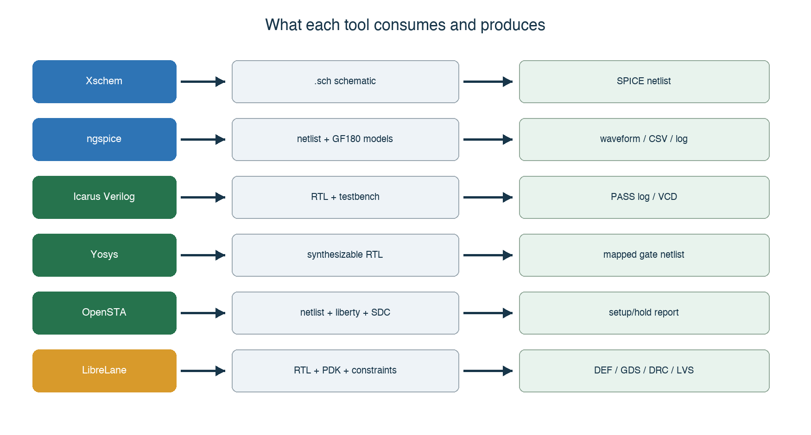
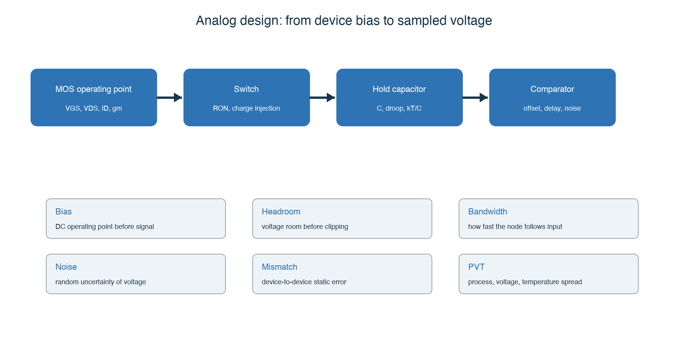
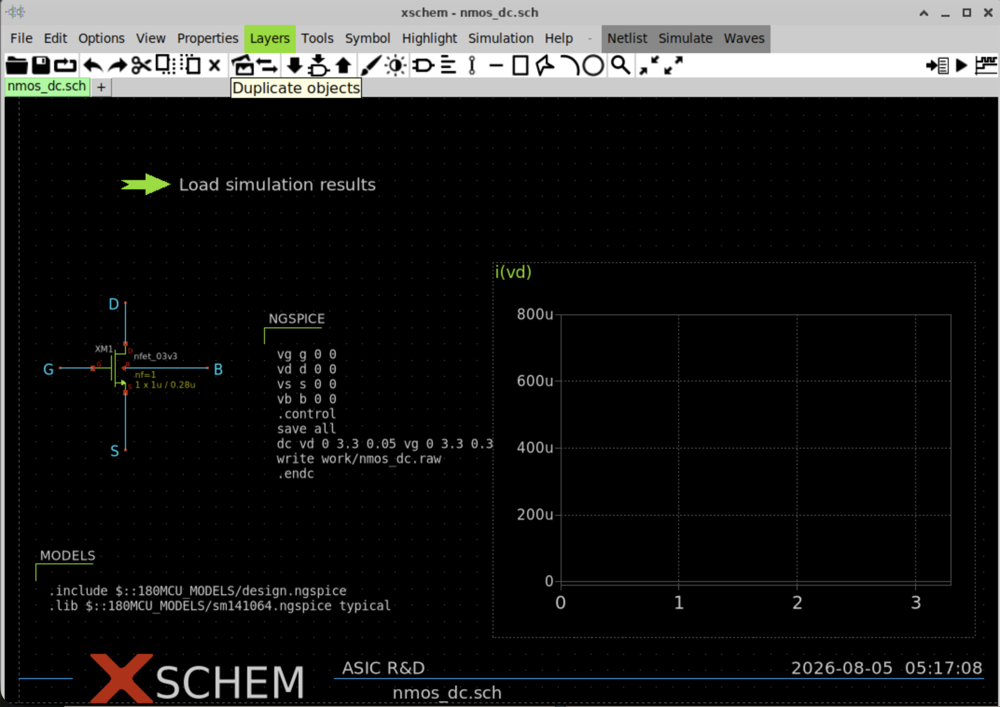
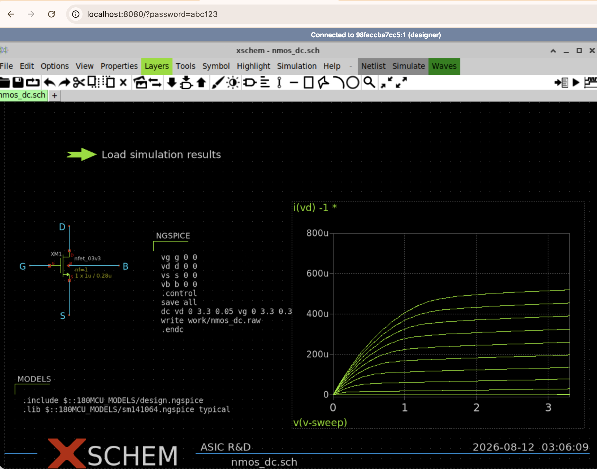
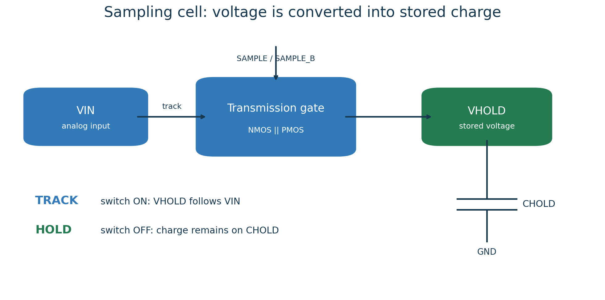
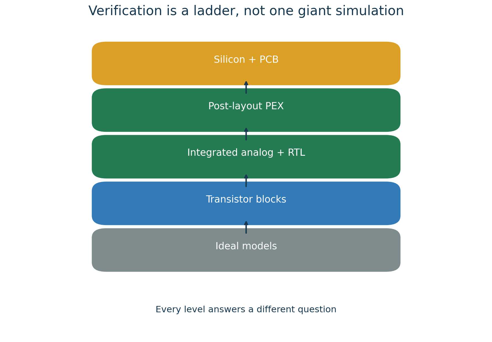

# ASIC Lab Handbook

{width=6.5in}

*Figure 1. Tape-out 1 signal path. Blue blocks are analog; green blocks are digital.*

Version 1.1 | 2026-08-14

Repository: <https://github.com/sykeisuke/asic_rd>

# Purpose of this handbook

This handbook is the primary working guide for the Tape-out 1 prototype. Its
goal is not to obtain the highest possible performance on the first attempt.
The goal is to demonstrate a complete, reproducible ASIC flow: specification,
schematic capture, SPICE simulation, RTL, mixed-signal verification, physical
design, signoff, fabrication, packaging, and measurement.

The reader should be able to inspect the design files, reproduce the recorded
results with the documented commands, and explain the engineering decision
that follows from each result. A screenshot alone is not evidence. Always keep
the input file, command, generated artifact, and pass/fail criterion together.

## Learning outcomes

After completing the handbook, the reader should be able to:

- explain MOS behavior and basic analog design using the GF180MCU PDK;
- explain Wilkinson conversion from sample-and-hold through digital capture;
- distinguish schematic, netlist, RTL, layout, and extracted views;
- reproduce the block-level and integrated verification results;
- explain the SPICE-to-RTL boundary and Gray-code CDC strategy;
- identify the outputs and limitations of synthesis, STA, DRC, LVS, and PEX;
- distinguish a flow prototype from a tape-out-ready full-chip design.

## Recommended sequence

| Stage | Labs | Outcome |
| --- | --- | --- |
| Foundations | 0-2 | Environment, PDK, MOS, sampling |
| Conversion | 3-5 | Comparator, ramp, one-cell and four-cell Wilkinson conversion |
| Digital | 6-8 | Controller, co-verification, CDC, serial readout |
| Physical design | 9 | Netlist-to-GDS flow and analog-layout planning |
| Design review | 10-16 | Evidence, blockers, specification, and tape-out readiness |

# 0. How to read an ASIC project

ASIC development combines circuit theory, software, semiconductor process
rules, packaging, and measurement. Do not try to memorize every term first.
For each task, identify three things: the input, the tool that processes it,
and the output artifact.

## Four representations to keep separate

| Representation | Meaning | Example in this repository |
| --- | --- | --- |
| Schematic | Human-readable components and connectivity | `nmos_dc.sch`, `sampling_cell.sch` |
| Netlist | Simulator-readable devices and connections | `*.spice`, Xschem-generated netlist |
| RTL | Clock-by-clock digital behavior | `*.v`, synthesizable Verilog |
| Layout | Geometric layers fabricated on silicon | DEF, GDSII |

Models are not silicon. A nominal SPICE result is not a production guarantee;
an RTL simulation does not include transistor behavior; and GDSII alone does
not include package, bond wire, PCB, or laboratory equipment.

## Units used throughout the project

| Prefix | Scale | Example |
| --- | --- | --- |
| m | 10^-3 | 1 mV = 0.001 V |
| u | 10^-6 | 1 us = 0.000001 s |
| n | 10^-9 | 1 ns |
| p | 10^-12 | 1 pF, 1 ps |

For every lab, record the Git commit, command, start and finish time, PASS/FAIL,
main artifact, and any observation that affects the next design decision.

# 1. Toolchain

{width=6.5in}

*Figure 2. Tool inputs and outputs. The Makefile provides stable entry points.*

| Tool | Role | What the designer does |
| --- | --- | --- |
| Docker Desktop | Runs the pinned Linux environment on macOS | Start Docker; check container and disk state |
| Make | Maps a target name to a repeatable command sequence | Run targets such as `make nmos-dc` |
| Xschem | Analog schematic editor and SPICE netlister | Place symbols, wire nets, edit properties, inspect netlists |
| ngspice | Transistor-level circuit simulator | Inspect logs, measurements, RAW and CSV waveforms |
| AWK/shell | Extracts results and applies automated checks | Read what each script treats as PASS |
| Icarus Verilog | RTL compiler and simulator | Compile, run testbenches, inspect VCD files |
| Yosys | RTL synthesis | Inspect mapped netlists and cell statistics |
| OpenSTA | Static timing analysis | Inspect SDC constraints and setup/hold reports |
| LibreLane/OpenROAD | Digital RTL-to-GDS flow | Review configuration, metrics, reports, DEF, and GDS |
| KLayout/Magic/Netgen | Layout viewing, DRC, and LVS | Inspect layers, pins, markers, and mismatches |

KLayout, Magic, and Netgen become central during analog layout. In the current
digital demonstration, LibreLane coordinates several backend tools.

# 2. What the Makefile does

`make` is not a simulator. It selects a target in the Makefile, which invokes
one or more scripts and tools. For example, `make nmos-dc` runs the Xschem and
ngspice path and then checks the generated data.

When a target fails:

1. open the corresponding `scripts/run-*.sh` file;
2. find the last successful command;
3. identify the first failing command and its inputs;
4. inspect the generated log before changing the design;
5. rerun the smallest failing step, then rerun the Make target.

| Target | Internal tools | Main artifacts |
| --- | --- | --- |
| `make nmos-dc` | Xschem, ngspice | Netlist, RAW, CSV |
| `make four-cell-cosim` | ngspice, shell/AWK, Icarus Verilog | Analog stimulus, co-simulation log |
| `make digital-top` | Icarus Verilog, Yosys, OpenSTA | VCD, mapped netlist, timing report |
| `make digital-physical` | LibreLane/OpenROAD | GDS, DEF, metrics, reports |

# 3. Analog-design foundations

{width=6.5in}

*Figure 3. Device bias, transient behavior, sampling error, and verification are connected.*

An analog node has continuous voltage, current, and time. Check the DC
operating point first, small-signal behavior second, and large transient,
noise, mismatch, and PVT behavior after the nominal circuit is understood.

## 3.1 MOS transistor essentials

| Quantity | Meaning | Typical check |
| --- | --- | --- |
| VGS | Gate-to-source voltage controlling channel formation | DC sweep |
| VDS | Drain-to-source voltage affecting region and headroom | I-V curve |
| ID | Drain current determining bias, power, and speed | Operating point |
| gm | Conversion strength from gate voltage to drain current | Operating point or derivative |
| ro | Finite output resistance in saturation | Slope of Id-Vds curve |
| W/L | Device geometry affecting current, capacitance, and mismatch | Schematic property |

A MOS device has four terminals. Always review body/bulk connections, body
effect, and parasitic junction diodes.

## 3.2 Bias, headroom, gain, and bandwidth

Bias is the no-signal operating state. Verify that each transistor is in the
intended region and every node remains within the rail limits. Headroom is the
voltage margin that allows the signal to move without forcing a device out of
its required operating region.

- DC operating point: Are node voltages and branch currents plausible?
- Gain: Does the required input change produce the required output change?
- Bandwidth: Is the response fast enough at the required frequency?
- Slew rate: Can large signals move at the required speed?
- Settling: Does the node enter the allowed error band before capture?

## 3.3 RC acquisition and hold

During tracking, the switch on-resistance and hold capacitance form an RC time
constant:

```text
tau = RON * CHOLD
error after time t = exp(-t/tau)
```

With `RON = 2 kohm` and `CHOLD = 1 pF`, `tau = 2 ns`; approximately 14 ns is
required for seven time constants. A real switch is signal-dependent, and the
source, wiring, pad, and MUX add resistance and capacitance.

## 3.4 Error, noise, PVT, and Monte Carlo

| Category | Examples | Verification |
| --- | --- | --- |
| Systematic | Comparator offset, ramp slope error | Corners and parameter sweeps |
| Random noise | Thermal noise, kTC noise | Noise/transient-noise analysis |
| Mismatch | Threshold and device-ratio variation | Monte Carlo mismatch |
| PVT | Process, supply, temperature | Corner matrix |
| Parasitic | Layout RC and coupling | PEX simulation |

For a new waveform, first check ground reference, rails, expected input range,
floating nodes, transition order, and the simulator time step. Only then judge
the detailed circuit behavior.

# 4. Module connectivity

{width=6.5in}

*Figure 4. Signal ownership and the analog-to-digital boundary.*

| Signal | Producer | Consumer | Meaning |
| --- | --- | --- | --- |
| `VIN` | Signal source/pad | Sampling transmission gate | Analog input |
| `SAMPLE[i:0]` | Controller/clock generation | Sampling cell | Digital track/hold control |
| `VHOLD[i]` | Hold capacitor | Analog MUX | Stored sampled voltage |
| `SEL[i:0]` | Controller | Analog MUX | One-hot cell selection |
| `VMUX` | Analog MUX | Comparator | Selected hold voltage |
| `VRAMP` | Ramp generator | Comparator | Wilkinson reference ramp |
| `HIT` | Comparator | Gray capture/controller | Asynchronous crossing event |
| `CODE[i]` | Gray capture | Code registers | One-cell result |
| `DATA` | Serializer | FPGA | 24-bit payload |

## 4.1 One conversion in time order

1. `SAMPLE[i]` turns on the transmission gate and `VHOLD[i]` follows `VIN`.
2. `SAMPLE[i]` turns off; `CHOLD[i]` stores the sampled voltage.
3. `SEL[i]` connects one `VHOLD[i]` to `VMUX`.
4. The MUX bus settles and is optionally reset between cells.
5. `VRAMP` starts while the Gray counter runs.
6. The comparator changes `HIT` when `VRAMP` crosses `VMUX`.
7. The capture circuit stores the Gray counter value.
8. The controller advances to the next cell and repeats the conversion.
9. Four 6-bit codes are assembled into one 24-bit word.
10. The serializer sends the word to the FPGA.

The controller-to-analog interface must define active polarity, pulse width,
one-hot constraints, settling time, reset state, and safe illegal states. The
comparator-to-capture interface must define edge polarity, synchronization,
maximum delay, and the invalid/missing-edge response.

# 5. Complete design flow

{width=6.5in}

*Figure 5. Tape-out requires evidence from specification through GDSII and signoff.*

| Block | Input and output | Tape-out 1 evidence |
| --- | --- | --- |
| Sampling cell | `VIN + SAMPLE -> VHOLD` | Four distinct values are stored in order |
| Analog MUX | `VHOLD[i] + SEL -> VMUX` | Only the selected cell drives the bus |
| Ramp | `START -> VRAMP` | Slope, reset, range, and repeatability |
| Comparator | `VMUX, VRAMP -> HIT` | Correct edge over required range |
| Gray capture | `CLK, HIT -> CODE` | Stable code near asynchronous crossing |
| Serializer | `CODE -> DATA` | Correct 24-bit frame and bit order |

# Lab 0. Read the repository

Run:

```sh
git clone https://github.com/sykeisuke/asic_rd.git
cd asic_rd
git status
make check
```

Read these files first:

1. `README.md` - entry point and quick start;
2. `docs/PROTOTYPE_SPECIFICATION.md` - controlled Tape-out 1 requirements;
3. `docs/TOP_LEVEL_INTERFACE.md` - current interface ownership;
4. `docs/VERIFICATION_MATRIX.md` - requirement-to-evidence mapping;
5. `docs/TAPEOUT_BLOCKERS.md` - unresolved release blockers.

Directory ownership:

- `simulations/`: Xschem/ngspice circuits and testbenches;
- `digital/`: synthesizable RTL, testbenches, and physical design;
- `mixed_signal/`: SPICE-to-RTL verification bridges;
- `docs/`: specifications, decisions, procedures, and evidence ownership;
- `work/` and `runs/`: generated artifacts, never the source of truth.

**Acceptance:** `make check` passes, the current commit is recorded, and the
reader can identify one source file and one generated artifact for each domain.

# 6. macOS, Docker, VNC, and `/foss`

The Mac is the host. Docker Desktop runs the pinned Linux image. Xschem and
other GUI tools run inside that Linux container and are displayed through a
browser-based VNC session.

```sh
cp .env.example .env
# Edit .env and set ASIC_RD_VNC_PASSWORD before the first start.
make vnc
```

Open <http://localhost:8080/> and enter the locally configured VNC password.
The repository is mounted as `/foss/designs`; PDKs and tools are provided by
the container under `/foss/pdks` and `/foss/tools`.

A Docker Hub account is normally unnecessary for public images unless a rate
limit, private image, or organization policy requires authentication.

## Troubleshooting checklist

| Symptom | Check |
| --- | --- |
| `localhost:8080` does not open | Docker state, `make vnc` log, port conflict |
| Xschem cannot find PDK symbols | `PDK`, `PDK_ROOT`, and `/foss/pdks` mount |
| `/foss/designs` is empty | Host repository path and volume mount |
| A file is missing after editing | Host/container path ownership and current directory |
| macOS blocks a Docker helper | Docker version, signature, and approved installation source |

# 7. First use of Xschem

1. Run `make vnc` from the repository root.
2. Open the browser desktop.
3. In File Manager, open
   `/foss/designs/simulations/gf180_nmos_dc/nmos_dc.sch`.
4. Confirm the MOS symbol, voltage sources, ground, model include, and analysis
   command before running the simulator.

{width=6.5in}

*Figure 6. NMOS DC schematic. An empty graph is expected before loading the RAW data.*

## 7.1 Display the first waveform

From the Mac terminal:

```sh
make nmos-dc
```

Confirm that `simulations/gf180_nmos_dc/work/nmos_dc.raw` exists and is not
empty. In Xschem, use **Ctrl + left click** on the green **Load simulation
results** launcher. A normal click selects the launcher; a double-click opens
its properties.

{width=6.5in}

*Figure 7. Id-Vds curves for multiple VGS values.*

The horizontal axis is VDS, the vertical axis is drain current, and each curve
corresponds to a different VGS. Check the linear region, saturation behavior,
current magnitude, and monotonic ordering.

## 7.2 Trace Xschem to ngspice

The path is:

```text
nmos_dc.sch -> generated SPICE netlist -> ngspice -> RAW/CSV -> graph/check
```

Inspect the device instance, model include, source definitions, `.dc` command,
and output path. If Xschem reports a missing RAW file, verify the working
directory and the exact path written by the simulation control block.

# 8. Digital tools

| Purpose | Command/tool | Evidence |
| --- | --- | --- |
| Compile | `iverilog -g2012 ...` | Syntax and supported constructs |
| Simulate | `vvp work/testbench` | PASS/FAIL, events, VCD |
| Inspect waves | GTKWave or another VCD viewer | Clock, reset, state, code, serial data |
| Synthesize | Yosys | Mapped netlist and cell use |
| Analyze timing | OpenSTA | Constraints, setup/hold slack |
| Place and route | LibreLane/OpenROAD | DEF, GDS, metrics, signoff reports |

A VCD confirms event ordering, not analog voltage behavior. Synthesis also
removes many simulation conveniences: real-number behavior, arbitrary delays,
unsupported constructs, and non-synthesizable testbench code.

# Lab 1. Measure a GF180 MOS device

Run:

```sh
make nmos-dc
```

Tasks:

1. identify the GF180 device model, W, L, body, and supply;
2. explain the VGS and VDS sweep;
3. locate the CSV and RAW artifacts;
4. change device width in a separate experiment and predict the current change;
5. rerun the simulation and compare prediction with the result.

**Acceptance:** ngspice exits without error, the expected CSV exists, drain
current increases with width under the same bias, and the change is committed
only after the schematic, generated netlist, and result agree.

# Lab 2. Sampling cell

Run:

```sh
make sampling-cell
make four-cell-mux
```

{width=6.2in}

*Figure 8. During TRACK, VHOLD follows VIN. During HOLD, charge remains on CHOLD.*

The ideal-switch model isolates timing logic from transistor limitations. The
GF180 NMOS-only and transmission-gate versions reveal on-resistance, signal
range, acquisition error, and charge injection.

{width=6.5in}

*Figure 9. Ideal and transistor-level sampling-cell waveforms.*

Inspect in this order:

1. verify that `SAMPLE` is high during the acquisition window;
2. verify that `VHOLD` follows `VIN` while tracking;
3. measure acquisition error immediately before the falling edge;
4. inspect the edge disturbance after the switch opens;
5. measure hold droop over the defined interval;
6. confirm that only the selected cell changes in the four-cell test.

**Acceptance:** four cells store the intended sequence; unselected cells are
not overwritten; acquisition error, edge disturbance, and droop are measured;
and the transmission-gate control is complementary and non-overlapping.

# Lab 3. Comparator and ramp

Run:

```sh
make comparator
make comparator-range
make comparator-offset
make ramp-generator
```

{width=6.2in}

*Figure 10. The comparator converts a voltage crossing into an event time.*

{width=6.5in}

*Figure 11. Ramp reset, linear rise, sampled voltage, and comparator output.*

Measure logic swing, propagation delay, common-mode/input range, trip-point
offset, ramp slope, linearity, reset level, and cycle-to-cycle repeatability.
The nominal 6-bit reference uses a 1.6 V conversion range and approximately
25 mV/LSB. These values are a prototype target, not a silicon guarantee.

# Lab 4. One-cell Wilkinson slice

Run:

```sh
make wilkinson-slice
make transfer
```

The one-cell slice combines a sampled input, hold capacitor, ramp, comparator,
counter, and capture event. The expected code is approximately:

```text
code = (VHOLD - ramp_start) / ramp_slope / counter_period
```

{width=6.5in}

*Figure 12. Crossing waveform and coarse 6-bit transfer characteristic.*

**Acceptance:** code increases monotonically with input; codes remain in
`0..63`; measured values agree with the expected slope within the documented
tolerance; and dead regions or saturation are reported rather than hidden.

# Lab 5. Four-cell shared conversion

Run:

```sh
make four-cell-wilkinson
```

To inspect the integrated RAW waveform in GAW:

```sh
cd /foss/designs/simulations/gf180_four_cell_wilkinson
gaw work/four_cell_wilkinson.raw
```

Add `v(vin)`, `v(hold0)` through `v(hold3)`, `v(mux_bus)`, `v(ramp)`,
`v(reset)`, and `v(compare_out)` to separate panels. Use zoom-out first, then
zoom into one cell-conversion interval.

{width=6.45in}

*Figure 13. Stored levels, MUX bus, ramp, reset, and comparator crossing.*

Verify that the MUX bus matches the selected hold node, bus reset occurs
between cells, the comparator toggles once per conversion, and the crossing
time increases with held voltage.

{width=6.2in}

*Figure 14. Shared ramp/comparator sequence and resulting cell codes.*

**Acceptance:** all four cells complete sequential conversion, no cell is
skipped, the selected voltage is stable before ramp start, and measured codes
match the expected order and tolerance.

# Lab 6. Controller RTL

Run:

```sh
make counter
make gray-counter
make controller
make digital-top
```

The controller sequence is:

1. `IDLE`: wait for a valid trigger;
2. `RESET_RAMP`: clear ramp and counter;
3. `SELECT`: assert exactly one cell select;
4. `CONVERT`: start the counter and wait for comparator hit or timeout;
5. `CAPTURE`: store the captured code;
6. `NEXT/DONE`: advance to the next cell or start serialization.

Inspect reset behavior, one-hot selection, capture pulse width, code stability,
timeout handling, and serialized payload. The analog blocks are represented by
testbench behavior here; this is not transistor-level mixed-signal simulation.

# Lab 7. SPICE-to-RTL co-verification

Run:

```sh
make four-cell-cosim
```

This flow extracts crossing events from SPICE, converts them into deterministic
RTL testbench stimulus, and checks end-to-end code ordering.

The interface contract must define time unit, edge polarity, sampling rule,
code format, timeout, and invalid cases. Debug in this order: SPICE CSV,
extracted event list, testbench pulse, capture enable, captured code, then the
expected-code comparison.

# Lab 8. Gray capture and CDC

Run:

```sh
make phase-sweep
```

{width=6.2in}

*Figure 15. Captured code around a clock-boundary phase sweep.*

An asynchronous comparator edge may arrive close to a counter transition.
Binary counters can change multiple bits at once; Gray code changes one bit at
a time and limits the ambiguity at the capture boundary.

**Acceptance:** captures away from the boundary match the expected code; a
boundary event differs by at most the documented adjacent-code ambiguity; and
no unstable multi-bit failure appears in the phase sweep.

# 9. 24-bit serial readout

Four 6-bit cell results form one 24-bit word. Define and verify bit order,
frame start, serial clock phase/polarity, valid/ready behavior, reset state,
idle level, and timeout behavior.

Logic-analyzer acceptance procedure:

1. release reset;
2. apply known codes such as 16, 20, 27, and 35;
3. start serialization;
4. capture 24 clock edges;
5. reconstruct the word with the documented bit order;
6. confirm frame length, payload, and idle recovery.

# Lab 9. RTL-to-GDS

Run:

```sh
make digital-physical
```

{width=5.3in}

*Figure 16. GF180 standard-cell digital physical-design result.*

Review die/core dimensions, utilization, standard-cell count, total wire
length, estimated power, clock constraints, setup slack, hold slack, DRC, LVS,
antenna, and generated GDS/DEF/netlist views.

## 9.1 Analog layout is a separate design task

Digital place-and-route does not create a production analog layout. The
sampling switch, MUX, ramp, and comparator require analog layout decisions:

- device matching and orientation;
- short, shielded high-impedance nodes;
- symmetric differential paths;
- guard rings and well ties;
- quiet analog supplies and return paths;
- controlled input-bus and pad parasitics;
- extraction and post-layout re-simulation.

## 9.2 DRC, LVS, and PEX order

```text
schematic simulation
  -> layout
  -> DRC
  -> extraction
  -> LVS
  -> PEX simulation
```

DRC checks geometric rules. LVS checks schematic-to-layout connectivity and
device correspondence. PEX adds extracted resistance and capacitance so that
sampling error, ramp slope, comparator delay, and settling can be reevaluated.

# 10. Reading signoff results

{width=5.5in}

*Figure 17. Verification proceeds from ideal models to silicon and PCB measurements.*

| Check | Required result | Meaning |
| --- | --- | --- |
| DRC | Zero unwaived violations | Geometry satisfies the selected rule deck |
| Antenna | Zero unresolved violations | Process charging risk is controlled |
| LVS | Match | Layout connectivity/devices agree with schematic/netlist |
| Setup | Non-negative slack | Data arrives before the capture requirement |
| Hold | Non-negative slack | Data remains stable after the capture edge |

Confirm that each report belongs to the current commit, PDK/library version,
netlist, constraints, and final GDS. A zero in an old or unrelated report is
not signoff evidence.

# 11. Reproducible debugging

Use this loop:

1. rerun the smallest failing command;
2. minimize the failing case to one cell or event;
3. record input, initial state, output, and time base;
4. change one variable at a time;
5. convert the failure into a regression test;
6. rerun the local test, then the complete regression;
7. record the decision and commit the source and test together.

Common categories include SPICE convergence, floating nodes, time-step error,
wrong edge polarity, CDC ambiguity, RTL timeout, incorrect reset, DRC/LVS
mismatch, missing constraints, and pad/package assumptions.

# 12. Practical exercises

## Exercise A: Reproduction report

- Run `make check` and `make four-cell-wilkinson`.
- Record commit, command, runtime, PASS/FAIL, and two key artifacts.
- Explain why the evidence is reproducible.

## Exercise B: ADC design change

- Change ramp slope, conversion time, or code scale in a branch.
- Predict the expected code change before simulation.
- Update the verification criterion and compare prediction with measurement.

## Exercise C: CDC boundary

- Run the phase sweep.
- Explain why binary capture can fail and why Gray capture limits ambiguity.
- Identify what remains an implementation assumption.

## Exercise D: Physical experiment

- Change clock constraint, utilization, or one synthesis option.
- Compare area, slack, wire length, runtime, and cell count.
- Record the tradeoff in the repository.

# 13. From prototype to tape-out

The repository demonstrates important parts of the flow, but foundry release
requires additional controlled evidence.

| Area | Required before release |
| --- | --- |
| MPW/provider | Exact run, PDK release, submission checklist, area, schedule |
| Analog layout | Sampling/MUX/ramp/comparator layout and PEX verification |
| PVT/Monte Carlo | Corners, mismatch, offset, ramp, settling, calibration plan |
| Top integration | Pad ring, I/O cells, ESD, level shifting, supply domains |
| Package/PCB | Bond map, package/COB constraints, evaluation PCB, FPGA interface |
| Full-chip signoff | Top DRC/LVS, antenna, ERC, density, timing, deliverable audit |

## Tape-out readiness review

- [ ] Exact PDK and provider template revision are frozen.
- [ ] Every requirement maps to current test evidence.
- [ ] No waiver is undocumented or ownerless.
- [ ] Pad ring, seal ring, density fill, and top-level GDS are complete.
- [ ] Package, PCB, pin map, and power-up sequence agree.
- [ ] First-silicon measurements and expected limits are defined.

Higher sample rate increases clock-skew, aperture, switch-settling, bus-loading,
feedthrough, and calibration difficulty. Higher resolution increases the
importance of comparator offset/noise, ramp linearity, supply noise, leakage,
and cell-to-cell pedestal variation. A 12-bit, 1 GSa/s target is therefore a
different verification and calibration problem, not a parameter-only change.

# 14. Tape-out 1 specification snapshot

The controlled source is `docs/PROTOTYPE_SPECIFICATION.md`; this table is only
a quick reference.

| Item | Tape-out 1 baseline |
| --- | --- |
| Process | GF180MCU open-PDK baseline, exact provider revision controlled separately |
| Channels | One analog channel |
| Storage depth | Four cells |
| ADC | Shared 6-bit Wilkinson conversion |
| Readout | 24-bit serial payload |
| Control | Synthesizable RTL finite-state machine |
| Primary objective | Demonstrate the complete reproducible design flow |
| Not yet claimed | Final bandwidth, precision, radiation tolerance, yield |

## Glossary

| Term | Meaning |
| --- | --- |
| PDK | Process models, devices, layers, rules, and libraries |
| MPW | Multi-project wafer sharing fabrication cost |
| SCA | Switched-capacitor array for analog sample storage |
| Wilkinson ADC | Converts voltage to crossing time, then time to a code |
| CDC | Clock-domain crossing |
| DRC | Design-rule check |
| LVS | Layout-versus-schematic comparison |
| STA | Static timing analysis |
| PEX | Parasitic extraction |
| GDSII | Final mask-layout exchange format |

# 15. Command quick reference

| Command | Purpose |
| --- | --- |
| `make check` | Environment and repository sanity |
| `make nmos-dc` | GF180 NMOS DC sweep |
| `make sampling-cell` | Single sampling-cell simulation |
| `make four-cell-mux` | Four-cell sampling and analog selection |
| `make comparator` | Comparator nominal test |
| `make comparator-range` | Comparator input/common-mode range |
| `make comparator-offset` | Offset sensitivity |
| `make ramp-generator` | Ramp generation and reset |
| `make wilkinson-slice` | One-cell Wilkinson conversion |
| `make transfer` | ADC transfer characteristic |
| `make four-cell-wilkinson` | Shared four-cell analog conversion |
| `make gray-counter` | Gray counter RTL |
| `make controller` | Conversion controller RTL |
| `make four-cell-cosim` | SPICE-to-RTL co-verification |
| `make phase-sweep` | CDC boundary sweep |
| `make digital-top` | Digital regression, synthesis, and STA |
| `make digital-physical` | RTL-to-GDS demonstration |
| `make vnc` | Browser-based analog design desktop |
| `make stop` | Stop the design container |

# 16. Final review sheet

The prototype complete-flow claim is justified only when all applicable items
below have current, reproducible evidence.

- [ ] Four-cell, 6-bit behavior is reproduced.
- [ ] Sampling error and ADC-code error are measured.
- [ ] Ramp, comparator, and counter behavior are consistent.
- [ ] Gray capture passes the phase-sweep criterion.
- [ ] The SPICE-to-RTL contract is documented and tested.
- [ ] DRC/LVS/STA reports correspond to the current source and constraints.
- [ ] Every result identifies source, command, generated artifact, and criterion.
- [ ] Remaining tape-out blockers have an owner and closure condition.

Primary references:

- `README.md`
- `docs/PROTOTYPE_SPECIFICATION.md`
- `docs/PDK_PAD_SUPPLY_FREEZE.md`
- `docs/TOP_LEVEL_INTERFACE.md`
- `docs/VERIFICATION_MATRIX.md`
- `docs/TAPEOUT_BLOCKERS.md`
- `docs/decisions/`
