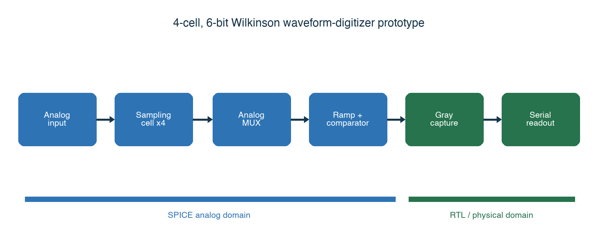
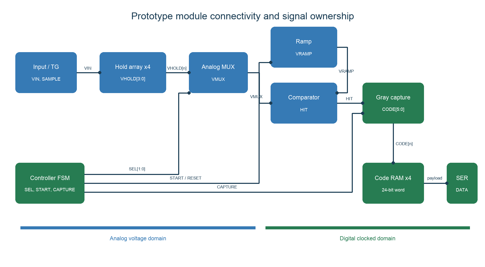
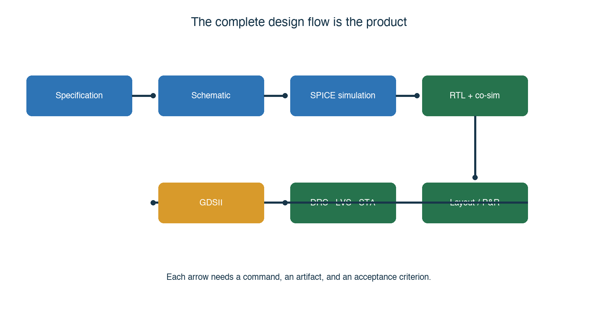
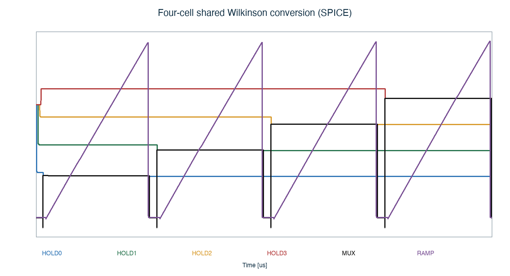

*図1　本プロトタイプの信号経路。青はアナログ、緑はデジタル領域。*

Version 1.0 \| 2026-08-11

Repository: github.com/sykeisuke/asic\_rd

# このハンドブックの目的

この教材のゴールは、最高性能のASICを一度で作ることではありません。仕様、回路図、SPICE、RTL、協調検証、配置配線、サインオフ、GDSIIという一連の流れを、誰でも再現できる形で通すことです。学生はGitHubの設計ファイルを読み、同じコマンドで結果を再生成し、次の設計判断を説明できる状態を目指します。

|                                                                                                                                |
|--------------------------------------------------------------------------------------------------------------------------------|
| **最重要原則** 結果のスクリーンショットだけを信用しない。入力ファイル、実行コマンド、生成物、合否基準の4点を常に対応づけます。 |

## 学習成果

-   GF180 PDKを使ったMOS特性と基本アナログ回路を説明できる。

-   サンプル・ホールド、ランプ、コンパレータからWilkinson
    ADCの変換原理を説明できる。

-   SPICEイベントをRTLへ渡す境界と、Gray
    codeを用いたCDC対策を説明できる。

-   RTL-to-GDSフローの各成果物とDRC/LVS/STAの意味を説明できる。

-   prototypeとtape-out-ready
    designの違いを、未解決項目を含めて説明できる。

## 推奨の進め方

| **段階**     | **Lab** | **成果**                             |
|--------------|---------|--------------------------------------|
| 基礎         | 0–2     | 環境、PDK、MOS、sampling             |
| 変換器       | 3–5     | comparator、ramp、1/4-cell Wilkinson |
| デジタル     | 6–8     | controller、co-sim、CDC、serial      |
| 物理実装     | 9       | netlistからGDSII                     |
| 設計レビュー | 10      | 証拠、blocker、次版仕様              |

# 0. 初学者のための読み方

ASIC設計では、回路、software、半導体process、測定の言葉が同時に登場します。最初から全用語を暗記する必要はありません。まず『何を入力し、どの道具で処理し、何が出力されるか』の3点だけを追い、波形やlogを見ながら意味を増やします。

## 最初に区別する4つ

| **言葉**           | **簡単な意味**                       | **このprojectの例**              |
|--------------------|--------------------------------------|----------------------------------|
| 回路図 / schematic | 部品と接続を人が読む図               | nmos\_dc.sch, sampling\_cell.sch |
| netlist            | simulatorが読む部品と接続の文章      | \*.spice, Xschem生成netlist      |
| RTL                | clockごとのdigital動作を記述する文章 | \*.v, synthesizable Verilog      |
| layout             | silicon上のlayer形状                 | DEF, GDSII                       |

## modelと実物を混同しない

-   SPICE modelはtransistorの電気的近似。nominal
    simulationが通ってもsilicon保証ではない。

-   RTL simulationはlogicとclock順序を確認する。transistor-level
    analog挙動は含まない。

-   GDSは形状データ。package、bond
    wire、PCB、測定器まで含めて初めて実験systemになる。

## 数値と単位

| **接頭語** | **倍率** | **例**            |
|------------|----------|-------------------|
| m          | 10^-3    | 1 mV = 0.001 V    |
| µ / u      | 10^-6    | 1 µs = 0.000001 s |
| n          | 10^-9    | 1 ns              |
| p          | 10^-12   | 1 pF, 1 ps        |

|                                                                                                                                                               |
|---------------------------------------------------------------------------------------------------------------------------------------------------------------|
| **実験ノート** 各Labで、commit hash、command、開始時刻、終了時刻、PASS/FAIL、主要artifact、気づきを記録します。再現できない成功は設計結果として弱いからです。 |

# 1. 使用ツールを理解する


*図3　各toolの入力と出力。Makefileはこの連鎖を短いcommandで実行する。*

| **Tool**             | **役割**                                     | **学生が直接行うこと**                      |
|----------------------|----------------------------------------------|---------------------------------------------|
| Docker Desktop       | 固定Linux環境をMac上で動かす                 | 起動、container状態とdisk容量確認           |
| Make                 | 複数commandをtarget名へまとめる              | make nmos-dc等を実行                        |
| Xschem               | analog回路図編集とSPICE netlist生成          | symbol配置、wire、property編集、netlist確認 |
| ngspice              | transistor-level simulation                  | log、測定値、CSV波形を読む                  |
| AWK                  | log/CSVの抽出と自動合否判定                  | scriptが何をPASS条件にするか読む            |
| Icarus Verilog       | RTL simulation                               | iverilogでcompile、vvpで実行、VCD確認       |
| Yosys                | RTL synthesis                                | mapped netlistとcell統計を読む              |
| OpenSTA              | static timing analysis                       | SDC constraintとsetup/hold report確認       |
| LibreLane            | RTL-to-GDS orchestration                     | config.yaml、metrics、final GDS確認         |
| KLayout/Magic/Netgen | layout閲覧、DRC/LVS。analog layoutで本格使用 | layer、pin、DRC marker、LVS mismatch確認    |

|                                                                                                                                                        |
|--------------------------------------------------------------------------------------------------------------------------------------------------------|
| **現在と将来** KLayout/Magic/Netgenはanalog layout段階で直接操作します。現時点のdigital physical flowではLibreLaneが複数backend toolを統括しています。 |

# 2. Makefileの裏側

makeはsimulatorではありません。Makefileでtarget名をshell
scriptへ対応づける入口です。たとえば make nmos-dc は
scripts/run-nmos-dc.sh
を呼び、そのscriptがDocker内でXschemとngspiceを実行します。

```text
make nmos-dc
  -> scripts/run-nmos-dc.sh
  -> docker run -v <repo>:/foss/designs
  -> xschem -n ... nmos_dc.sch
  -> ngspice -b ...spice
  -> work/nmos_id_vds.csv
```

## scriptを読む順番

1.  set -eu を確認する。errorや未定義変数で停止する設定。

2.  eda-common.shからEDA\_IMAGE、PROJECT\_ROOT、Docker CLIを読む。

3.  docker
    runの-vを見て、Mac側repoとcontainer内/foss/designsの対応を理解する。

4.  container内のcd先を確認する。

5.  実行toolとoptionを読む。-bはbatch、-oはlog出力など。

6.  最後のtest/grepを読み、何をPASSとしているか確認する。

## 代表的な実行経路

| **Target**            | **内部tool**                      | **主なartifact**                      |
|-----------------------|-----------------------------------|---------------------------------------|
| make nmos-dc          | Xschem → ngspice                  | netlist, raw, CSV                     |
| make four-cell-cosim  | ngspice → grep/AWK → iverilog/vvp | analog\_stimulus.vh, cosimulation.log |
| make digital-top      | iverilog/vvp → Yosys → OpenSTA    | VCD, mapped.v, timing log             |
| make digital-physical | LibreLane/OpenROAD ecosystem      | GDS, DEF, metrics, reports            |

|                                                                                                                                                  |
|--------------------------------------------------------------------------------------------------------------------------------------------------|
| **自走のコツ** makeが失敗したらtarget名だけを眺めず、対応するscripts/run-\*.shを開き、最後に成功したcommandと最初に失敗したcommandを特定します。 |

# 3. アナログ設計の基礎


*図4　deviceのbiasからsampling誤差までを一つの因果関係として考える。*

digital信号は0/1へ抽象化できますが、analog
nodeは連続した電圧・電流・時間を持ちます。回路を読むときは、まずDC
operating point、次に小さなsignalへの応答、最後にlarge
transientとnoise/mismatchの順で考えると整理しやすくなります。

## 3.1 MOS transistorの最低限

| **量** | **意味**                                      | **確認方法**        |
|--------|-----------------------------------------------|---------------------|
| VGS    | gate-source間電圧。channel形成を支配          | DC sweep            |
| VDS    | drain-source間電圧。動作領域とheadroomに関係  | I-V curve           |
| ID     | drain電流。bias/power/速度を決める            | operating point     |
| gm     | gate電圧変化を電流へ変える強さ                | op resultまたは微分 |
| ro     | saturation領域の有限出力抵抗                  | Id-Vdsの傾き        |
| W/L    | device geometry。電流、容量、mismatchを変える | schematic property  |

|                                                                                                                  |
|------------------------------------------------------------------------------------------------------------------|
| **body端子** MOSは4端子deviceです。bulk/body接続を省略して考えると、body effectやparasitic diodeを見落とします。 |

# 3.2 Bias、headroom、gain、bandwidth

Biasはsignalがないときの静止状態です。transistorが意図した領域に入り、全nodeが電源範囲内にあることを先に確認します。Headroomはsignalが振れてもdeviceが必要な電圧を保てる余裕です。

-   DC operating point: node電圧とbranch電流が妥当か。

-   Gain: 小さな入力変化が出力へ何倍伝わるか。

-   Bandwidth: gainが低下せず追従できる周波数範囲。

-   Slew rate: large signalで出力が変化できる最大速度。

-   Settling: 目標値の許容誤差内へ入るまでの時間。

## RCとsampling

switchのON抵抗RONとhold capacitance Cは時定数 τ = RON·C
を作ります。一次近似では誤差は exp(−t/τ) で減少します。sampling
pulseが短すぎると、hold
nodeは入力へ十分settleしません。一方Cを大きくするとkT/C
noiseとdroopは改善しやすいものの、acquisitionは遅く、面積も増えます。

| **Cを大きくすると** | **良くなりやすい**                    | **悪くなりやすい**                 |
|---------------------|---------------------------------------|------------------------------------|
| 効果                | kT/C noise、droop、charge sharing感度 | acquisition time、switch負荷、面積 |

## 簡単な計算例

RON = 2 kΩ、C = 1 pFなら τ = 2
nsです。0.1%程度までsettleさせるには約7τ、すなわち約14
nsが一つの目安です。これはfirst-order近似であり、実回路ではsignal-dependent
RONや寄生容量をSPICEで確認します。

# 3.3 誤差、noise、PVT、Monte Carlo

| **分類**         | **例**                              | **検証**                            |
|------------------|-------------------------------------|-------------------------------------|
| Systematic error | comparator offset、ramp slope error | corner/parameter sweep、calibration |
| Random noise     | thermal noise、kT/C                 | noise/transient noise、統計         |
| Mismatch         | 同じ寸法のMOS間の差                 | Monte Carlo mismatch                |
| PVT              | process、supply、temperature        | corner matrix                       |
| Parasitic        | layout R/C、coupling                | PEX後simulation                     |

Nominal simulationはtypical
model、代表電源、代表温度での一例です。Tape-out判断には、fast/slow
device corner、電源min/max、温度範囲、mismatch seed、extracted
parasiticを組み合わせたverification planが必要です。

## 初学者が波形を見る順序

7.  電源とgroundが期待値か。

8.  入力刺激の振幅・位相・立上りが想定どおりか。

9.  内部nodeがrailへ張り付いていないか。

10. 出力の極性が合っているか。

11. 時間軸と電圧軸の単位が合っているか。

12. 測定cursorだけでなく前後のtransientも見る。

|                                                                                                   |
|---------------------------------------------------------------------------------------------------|
| **重要** 波形の形を先に眺め、後から都合のよい測定点を探さない。先に測定定義と合否条件を書きます。 |

# 4. モジュールの接続



*図5　信号名付きmodule接続。controllerが時間順序を作り、analog
crossingをGray captureがcodeへ変える。*

| **Signal**    | **Producer**                | **Consumer**               | **種類・意味**              |
|---------------|-----------------------------|----------------------------|-----------------------------|
| VIN           | signal source/pad           | sampling transmission gate | analog voltage              |
| SAMPLE\[3:0\] | controller/clock generation | sampling cells             | digital control             |
| VHOLD\[3:0\]  | hold capacitors             | analog MUX                 | stored analog voltage       |
| SEL\[1:0\]    | controller                  | analog MUX                 | selected cell index         |
| VMUX          | analog MUX                  | comparator                 | selected held voltage       |
| VRAMP         | ramp generator              | comparator                 | time reference voltage      |
| HIT           | comparator                  | Gray capture/controller    | asynchronous crossing event |
| CODE\[5:0\]   | Gray capture                | code registers             | one cell result             |
| DATA          | serializer                  | FPGA                       | 24-bit payload, serial      |

# 4.1 1回の変換を時系列で追う

13. Track: SAMPLE\[n\]=1。switchがONになりVHOLD\[n\]がVINへ追従する。

14. Hold: SAMPLE\[n\]=0。switchをOFFにし、capacitorへ電圧を保存する。

15. Select: SEL=n。VHOLD\[n\]だけをVMUXへ接続する。

16. Settle: MUX切替によるtransientが収まるまで待つ。

17. Reset: VRAMPとcounterを既知値へ戻す。

18. Convert: rampを開始し、Gray counterを進める。

19. Compare: VRAMPがVMUXを横切るとHIT edgeが発生する。

20. Capture: HIT近傍のGray codeを保存しbinary codeへ扱う。

21. Repeat: n=0..3について繰り返す。

22. Readout: 4×6 bitを24-bit wordへ連結しserial送信する。

## analog/digital境界で決めること

| **境界**                   | **曖昧だと起きる問題**              | **固定事項**                                       |
|----------------------------|-------------------------------------|----------------------------------------------------|
| Comparator → capture       | ±1以上の誤code、metastability       | edge polarity、synchronization、capture convention |
| Controller → analog switch | short、charge sharing、settling不足 | non-overlap、pulse width、SEL timing               |
| Code RAM → serializer      | cell順・bit順が逆                   | packing order、MSB/LSB first、frame valid          |

|                                                                                                                                                                |
|----------------------------------------------------------------------------------------------------------------------------------------------------------------|
| **設計レビュー** 各arrowについてproducer、consumer、voltage domain、clock domain、active polarity、reset stateを説明できれば、接続の理解がかなり進んでいます。 |

# 1. 全体設計フロー



*図2　仕様からGDSIIまで。各矢印が検証可能であることがcomplete
flowの条件。*

## ブロックの役割

| **ブロック**         | **入力 → 出力**           | **このprototypeで確認すること**      |
|----------------------|---------------------------|--------------------------------------|
| Sampling cell        | VIN + SAMPLE → VHOLD      | 4つの異なる電圧を保持できる          |
| Analog MUX           | VHOLD\[3:0\] + SEL → VMUX | 選択セルだけを共有ADCへ接続する      |
| Ramp                 | START → VRAMP             | 単調な電圧-時間変換を作る            |
| Comparator           | VMUX, VRAMP → HIT         | 交差時刻をデジタルイベントへ変換する |
| Gray counter/capture | CLK, HIT → CODE\[5:0\]    | 境界付近でも多bit同時遷移を避ける    |
| Serializer           | CODE x4 → DATA            | 少ないpad数でFPGAへ読み出す          |

|                                                                                                                                           |
|-------------------------------------------------------------------------------------------------------------------------------------------|
| **今回の仕様** 4 storage cells、6-bit変換、共有ramp/comparator、24-bit serial readout。速度・分解能・帯域よりもflowの完結性を優先します。 |

# Lab 0 リポジトリを読む

|                                                                         |
|-------------------------------------------------------------------------|
| **到達目標** 設計ソースと生成物を区別し、再現コマンドを自分で見つける。 |

git clone https://github.com/sykeisuke/asic\_rd.git<br>
cd asic\_rd<br>
git status<br>
make check

## 最初に読む5ファイル

| **ファイル**                     | **読む理由**                           |
|----------------------------------|----------------------------------------|
| README.md                        | 入口、クイックスタート、全体構成       |
| docs/PROTOTYPE\_SPECIFICATION.md | 何を作るか、数値仕様、success criteria |
| docs/TOP\_LEVEL\_INTERFACE.md    | アナログ/デジタル境界とI/O             |
| docs/VERIFICATION\_MATRIX.md     | 要求とtestの対応                       |
| docs/TAPEOUT\_BLOCKERS.md        | prototype後に残る実装リスク            |

## ディレクトリの見方

-   simulations/: Xschem/ngspice用のアナログtestbenchと結果。

-   digital/: synthesizable RTL、testbench、physical design設定。

-   docs/: 仕様、判断記録、検証表。

-   work/ や runs/: 再生成できる中間成果物。設計のsource of
    truthと混同しない。

## 確認問題

-   現在のHEAD commitを記録し、実験ノートに貼る。

-   VERIFICATION\_MATRIXの1行を選び、要求、test、artifact、判定を説明する。

# 2. Mac + Docker開発環境

Macはホストとして十分に使えます。Linux向けEDAツールとGF180
PDKはDockerコンテナ内へ固定し、XschemなどGUIはブラウザVNCから操作します。これにより学生ごとのmacOS差を小さくします。

23. Docker
    Desktopを起動し、メイン画面でEngineがRunningであることを確認する。

24. リポジトリで make vnc を実行する。

25. ブラウザで http://localhost:8080/?password=abc123 を開く。

26. File Managerから
    /foss/designs/simulations/gf180\_nmos\_dc/nmos\_dc.sch を開く。

cd /Users/ykeisuke/Desktop/mywork/asic\_rd<br>
make vnc<br>
\# Browser: http://localhost:8080/?password=abc123

## アカウントは必要か

通常のローカルimage実行にDocker
Hubアカウントは必須ではありません。ただしprivate image、rate
limit回避、組織管理を使う場合はログインが必要です。授業では使用imageのdigestまたはtagを固定します。

## よくあるトラブル

| **症状**                 | **確認**                                             |
|--------------------------|------------------------------------------------------|
| localhost:8080が開かない | docker ps、make vncのログ、port競合                  |
| XschemにPDK symbolがない | PDK\_ROOTとコンテナ内mount                           |
| ファイル変更が見えない   | host pathと/foss/designsの対応                       |
| com.docker.vmnetd警告    | Docker公式最新版、残存helper、macOS Gatekeeperを確認 |

|                                                                                                                                         |
|-----------------------------------------------------------------------------------------------------------------------------------------|
| **安全上の注意** Gatekeeperを恒久的に無効化しない。Docker公式配布物を使い、異常が続く場合は再インストールとhelper cleanupを優先します。 |

# 5. Xschemを初めて使う

Xschemは回路図editorであり、simulation
engineそのものではありません。symbolとwireからSPICE
netlistを生成し、そのnetlistをngspiceへ渡します。本projectではGUI確認に加え、scriptからheadless
netlistingも行うため、手動操作と自動実行の結果を比較できます。

## 回路図を開く

27. make vncを実行し、browser desktopを開く。

28. File Managerで /foss/designs/simulations/gf180\_nmos\_dc/
    へ移動する。

29. nmos\_dc.schをdouble-clickする。関連付けで開かない場合はXschemを起動してFile &gt;
    Openを使う。

30. 画面上のNMOS symbol、voltage source、ground、simulation
    commandを探す。

31. symbolを選択してpropertyを開き、model名、W、L、multiplicityを読む。

## 配線を読むときの規則

-   線が交差してもjunction dotがなければ接続でない場合がある。

-   node labelが同じなら離れた場所でも同一netとして接続される。

-   ground/reference nodeがないSPICE回路は解けない。

-   MOSのD/G/S/B端子をsymbol向きだけで判断せずproperty/netlistでも確認する。

## 変更前に守ること

-   元のtestbenchを直接壊さず、学習用copyまたはGit branchを作る。

-   一度にW、L、bias、stimulusを同時変更しない。

-   変更前の予測を数値または増減方向で書く。

-   保存後にgit diffで意図した変更だけか確認する。

|                                                                                                                                                         |
|---------------------------------------------------------------------------------------------------------------------------------------------------------|
| **ショートカット** Xschemのshortcutはversionやkeymapで差があり得ます。授業ではまずmenu名で操作を共有し、各自の画面下status/helpでshortcutを確認します。 |

# 5.1 Netlistとngspiceを追跡する

make
nmos-dcを実行すると、Xschemはnmos\_dc.schからwork/nmos\_dc\_xschem.spiceを生成します。その後ngspiceがbatch
modeでnetlistを読み、raw dataとCSVを生成します。

```sh
xschem -n -q -x --rcfile <gf180-xschemrc> \\
  -o work -N nmos_dc_xschem.spice nmos_dc.sch
ngspice -b work/nmos_dc_xschem.spice
```

| **Option** | **意味**                            |
|------------|-------------------------------------|
| -n         | user configを限定して再現性を上げる |
| -q         | quiet startup                       |
| -x         | GUIを表示しないheadless実行         |
| --rcfile   | GF180 symbol/model pathを設定       |
| -o work    | 生成先directory                     |
| -N file    | netlist file名                      |
| ngspice -b | 対話画面なしのbatch simulation      |

## 出力を確認する

32. terminalの終了codeが0か確認する。

33. work/nmos\_dc\_xschem.spiceを開き、device instanceとmodel
    includeを探す。

34. work/nmos\_dc.rawが空でないことを確認する。

35. work/nmos\_id\_vds.csvのheader、行数、指数表記を読む。

36. 同じdirectoryのREADME.mdとRESULTS.mdがあればexpected
    resultと比較する。

|                                                                                                                                                                     |
|---------------------------------------------------------------------------------------------------------------------------------------------------------------------|
| **重要** generated netlistは回路図の翻訳結果です。回路図が正しそうでもnetlistのmodel名、node順、parameterが意図と違うことがあります。最初の数回は必ず両方を見ます。 |

# 5.2 Digital toolの使い分け

| **段階**  | **Command**               | **何を確認するか**                        |
|-----------|---------------------------|-------------------------------------------|
| Compile   | iverilog -g2012 ...       | syntax、module接続、unsupported construct |
| Run       | vvp work/tb               | assertion/PASS、event順序                 |
| Waveform  | VCDをGTKWave等で開く      | clock、reset、state、capture、serial data |
| Synthesis | yosys ... synth/abc       | logicがstandard cellへ写るか、cell数      |
| Timing    | sta -exit sta.tcl         | clock constraint、setup/hold slack        |
| Physical  | librelane ... config.yaml | floorplan、routing、DRC/LVS、GDS          |

## VCD波形の基本

37. 最初にclockとresetを表示する。

38. controller state、cell select、hit、captured codeを追加する。

39. cursorをcapture edgeへ置き、edge直前と直後の値を読む。

40. unknown X、高impedance Z、意図しないglitchを探す。

41. 最後にserializer clock/data/validを同じtimebaseで確認する。

## Synthesis後に失われるもの

testbench、\#delay、display、simulation専用real
modelはsiliconになりません。Yosysへ渡すsource
listに何が含まれるかをrun-digital-top.shで確認し、mapped netlistにGF180
standard-cell instanceが現れることを確認します。

# Lab 1 GF180 MOSを測る

|                                                                        |
|------------------------------------------------------------------------|
| **到達目標** NMOSのI–V曲線を再生成し、回路設計に使うbias領域を読める。 |

make nmos-dc

42. nmos\_dc.schを開き、device名、W/L、body接続、supplyを確認する。

43. testbenchのVGS/VDS sweep範囲を読む。

44. make nmos-dcを実行し、CSV/plotの生成時刻を確認する。

45. 同じVGSでVDSを上げたとき、linear領域からsaturation領域へ移る形を説明する。

## 成功判定

□ ngspiceがerrorなしで終了する。

□ simulations/gf180\_nmos\_dc/work/nmos\_id\_vds.csv が更新される。

□ 電流の符号、単位、sweep軸を説明できる。

## 設計者の問い

モデルが動くことと、回路が正しいことは別です。温度、process
corner、電源範囲、device optionがMPW
providerの許容条件に一致しているかを必ず後段で確認します。

|                                                                                                    |
|----------------------------------------------------------------------------------------------------|
| **演習** Wを2倍にしたvariantを作り、同じbiasでIdがどう変化するか予測してからsimulationで確認する。 |

# Lab 2 Sampling cell

|                                                                                       |
|---------------------------------------------------------------------------------------|
| **到達目標** track/hold動作、acquisition、droop、charge injectionを波形から評価する。 |

make sampling-cell<br>
make four-cell<br>
make four-cell-mux

## 観測順序

46. SAMPLE high中にVHOLDがVINへ追従することを確認する。

47. SAMPLE edge直後のstepを測り、charge
    injection/feedthroughを区別する。

48. hold期間の傾きを測り、droop rate \[V/s\]へ換算する。

49. 4-cell testで各cellが異なる時刻の電圧を保持することを確認する。

50. MUX選択を変え、非選択cellの値が破壊されないことを確認する。

| **Cell** | **保持電圧 \[V\]** | **目標 \[V\]** | **誤差 \[mV\]** |
|----------|--------------------|----------------|-----------------|
| 0        | 0.490799           | 0.500          | 9.201           |
| 1        | 0.792128           | 0.800          | 7.872           |
| 2        | 1.094365           | 1.100          | 5.635           |
| 3        | 1.399222           | 1.400          | 0.778           |

|                                                                                                      |
|------------------------------------------------------------------------------------------------------|
| **読み方** この値はprototype testbenchでのnominal結果です。PVT/Monte Carlo後の保証値ではありません。 |

## 失敗時の切り分け

-   全cellが同じ値：sampling pulseの位相またはnode namingを確認。

-   MUX busが浮く：SEL decodeとtransmission gateのcomplementary
    controlを確認。

-   保持値が急減：capacitance、leakage path、simulation timestepを確認。

# Lab 3 Comparatorとramp

|                                                                      |
|----------------------------------------------------------------------|
| **到達目標** 入力電圧を交差時刻へ変換し、ADCの主要誤差源を説明する。 |

make comparator<br>
make comparator-range<br>
make comparator-offset<br>
make ramp-generator

Wilkinson変換では、一定傾斜のrampが保持電圧へ到達した瞬間にcounter値をcaptureします。理想的には
t\_cross = (V\_hold − V\_start) / slope です。したがってramp
slope、offset、delay、noiseがcodeへ直接写ります。

## 測るもの

| **Test**   | **測定量**              | **設計への意味**         |
|------------|-------------------------|--------------------------|
| comparator | logic swing、delay      | デジタル側が認識できるか |
| range      | common-mode/input range | 変換可能なanalog範囲     |
| offset     | input-referred offset   | code bias、校正必要性    |
| ramp       | slope、linearity、reset | LSB幅とconversion time   |

## 6-bitの基準

入力範囲をVFSとすると理想LSBは VFS/64 です。1.6 V範囲なら25
mV/LSBです。prototypeではまずcode
orderingとmonotonicityを確認し、INL/DNLの保証は後続版へ分離します。

|                                                                                          |
|------------------------------------------------------------------------------------------|
| **演習** ramp slopeを±10%変え、同じ入力のcrossing timeとcodeがどれだけ変わるか表にする。 |

# Lab 4 1-cell Wilkinson slice

|                                                                                   |
|-----------------------------------------------------------------------------------|
| **到達目標** sampling、ramp、comparator、counterの因果関係を1つの波形で説明する。 |

make wilkinson-slice<br>
make transfer

51. sampling phaseでinputをhold capacitorへ保存する。

52. conversion startでramp resetを解除し、counterを開始する。

53. VRAMPがVHOLDへ到達するとcomparator edgeが発生する。

54. edge時のcounterをcaptureし、end-of-conversionまで保持する。

55. input sweepからcode transferを作り、単調性を確認する。

## 合否基準

□ 低い入力ほど早く交差し、小さいcodeになる。

□ inputを増やしてもcodeが逆戻りしない。

□ 0–63の範囲外へ出ない。

□ 飽和点とdead regionを波形上で説明できる。

|                                                                                                                                                         |
|---------------------------------------------------------------------------------------------------------------------------------------------------------|
| **注意** transient波形が自然に見えても、capture条件が1 timestep依存なら脆弱です。max timestepを変えた再実行でcodeが不合理に変化しないことを確認します。 |

# Lab 5 4-cell shared conversion

|                                                                        |
|------------------------------------------------------------------------|
| **到達目標** 4つの保持値を1つのramp/comparatorで順次6-bit code化する。 |

make four-cell-wilkinson



*図3　4-cell shared Wilkinson conversion。上段は保持値とMUX
bus、下段はrampとcomparator。*

| **Cell** | **MUX電圧 \[V\]** | **交差時刻 \[µs\]** | **6-bit code** |
|----------|-------------------|---------------------|----------------|
| 0        | 0.456612          | 0.831984            | 16             |
| 1        | 0.734986          | 1.040260            | 20             |
| 2        | 1.014740          | 1.399500            | 27             |
| 3        | 1.296100          | 1.771850            | 35             |

codeは保持値の順序に従って16 &lt; 20 &lt; 27 &lt;
35となっています。この段階の成功は、絶対精度よりもsample → select →
compare → captureの順序とデータ対応が崩れていないことです。

|                                                                                                                |
|----------------------------------------------------------------------------------------------------------------|
| **レビュー観点** MUX切替直後のsettling時間を十分取っているか。前cellの残留値が次のcrossingへ影響していないか。 |

# Lab 6 Controller RTL

|                                                                    |
|--------------------------------------------------------------------|
| **到達目標** 4-cell変換のsequencingを合成可能なRTLとして検証する。 |

make counter<br>
make gray-counter<br>
make controller<br>
make digital-top

## 状態遷移を言葉で書く

56. IDLE: startを待ち、各valid flagをclearする。

57. RESET\_RAMP: rampとcounterを既知状態へ戻す。

58. SELECT: 対象cellをMUXへ接続しsettlingを待つ。

59. CONVERT: Gray counterを進め、comparator hitを待つ。

60. CAPTURE: codeを対象registerへ保存する。

61. NEXT/DONE: 4 cell完了後にserializerへ引き渡す。

## RTL testで見るもの

-   reset直後にXが残らない。

-   cell selectがone-hotまたは仕様どおりのbinaryである。

-   captureは各cellにつき一度だけ発生する。

-   timeout時にもstate machineが停止し続けない。

-   doneとdata\_validのpulse/level仕様がtestbenchと一致する。

|                                                                                                                                  |
|----------------------------------------------------------------------------------------------------------------------------------|
| **設計ルール** simulation専用delay、initial依存、real型をsynthesizable coreへ持ち込まない。analogモデルはtestbench側へ置きます。 |

# Lab 7 SPICE-to-RTL協調検証

|                                                                                     |
|-------------------------------------------------------------------------------------|
| **到達目標** アナログ交差時刻をデジタルtestbenchへ渡し、end-to-end codeを照合する。 |

make four-cell-cosim

このプロジェクトの協調検証は、SPICEが生成したcrossing eventを抽出し、RTL
testbenchへ刺激として与える方式です。アナログsimulatorとRTL
simulatorを同時結合する重いAMS環境を使わず、境界条件を明示できます。

## 境界contract

| **項目**            | **固定すべき内容**                    |
|---------------------|---------------------------------------|
| time unit           | 秒、ns、psの変換規則                  |
| edge polarity       | rising/fallingのどちらがhitか         |
| sampling convention | edge直前/直後のcounterをcaptureするか |
| code format         | binary/Gray、bit order、width         |
| invalid case        | 未交差、timeout、saturationの表現     |

## debugの順番

62. SPICE CSVに交差が存在するか。

63. event抽出値の単位が正しいか。

64. testbenchで同時刻にpulseが生成されたか。

65. capture registerのenableが立ったか。

66. expected codeとの±1境界差か、根本的なsequence差か。

# Lab 8 Gray captureとCDC

|                                                                                     |
|-------------------------------------------------------------------------------------|
| **到達目標** comparator edgeがcounter clock境界へ近づく現実的な不確かさを検証する。 |

make phase-sweep


*図4　cell 2のphase sweep。+500 ps付近でcodeが27から28へ変わる。*

binary
counterは例として011111→100000のように複数bitが同時に変化します。非同期edgeがその途中をcaptureすると存在しないcodeになり得ます。Gray
counterは隣接code間で1
bitだけ変化するため、境界付近の不確かさを原則として隣接codeへ閉じ込めます。

## この結果の解釈

-   +400 psでは27、+600 psでは28。境界で±1
    codeとなることは量子化として自然。

-   +500 psはcell 2のboundary。これはsetup/hold保証を意味しない。

-   siliconではmetastability、clock skew、comparator
    delay分布も評価が必要。

|                                                                                                                                             |
|---------------------------------------------------------------------------------------------------------------------------------------------|
| **判断記録** 設計理由は docs/decisions/0003-gray-comparator-capture.md に残しています。コードだけでなく、なぜその方式を選んだかを読むこと。 |

# 3. 24-bit serial readout

4個の6-bit codeを24-bit
wordへまとめ、FPGAへserial転送します。pad数を抑えられる一方、bit
order、frame境界、clock domain、idle
levelを仕様として固定する必要があります。

make digital-top

| **Field** | **仕様確認**                       |
|-----------|------------------------------------|
| Payload   | code0, code1, code2, code3の連結順 |
| Bit order | MSB-firstまたはLSB-first           |
| Handshake | valid/ready、busy、done            |
| Clock     | ASIC生成かFPGA供給か               |
| Reset     | 途中reset時のline状態              |

## logic analyzerでの受入試験

67. 既知code 16, 20, 27, 35をloadする。

68. serial clockとdataを同時取得する。

69. 24 edge分をdecodeし、元の4 codeへ戻す。

70. frameを連続送信し、境界でbit slipがないことを確認する。

|                                                                                                                                                                                              |
|----------------------------------------------------------------------------------------------------------------------------------------------------------------------------------------------|
| **PCBへつながる仕様** I/O voltage、drive strength、level shifting、ground reference、connector pinoutはpad libraryと評価PCBの制約に依存します。prototype RTLの論理仕様だけでは確定しません。 |

# Lab 9 RTL-to-GDS

|                                                                                    |
|------------------------------------------------------------------------------------|
| **到達目標** 合成、floorplan、placement、CTS、routing、signoffの成果物を確認する。 |

make digital-physical


*図5　GF180 standard-cell flowで生成したデジタルtopの最終レイアウト。*

| **Metric**        | **結果**              |
|-------------------|-----------------------|
| Core/die size     | 215.49 × 233.41 µm    |
| Die area          | 50,297.5 µm²          |
| Utilization       | 39.5%                 |
| Standard cells    | 798（sequential 101） |
| Total wire / vias | 14,792 µm / 2,784     |
| Estimated power   | 6.13 mW               |

成果物は digital/asic\_digital\_top/physical/final\_views/
以下にあります。GDS、DEF、LEF、gate-level
netlist、metricsを相互に対応づけます。

# 4. Signoff結果の読み方

| **Check**         | **今回の結果** | **意味**                            |
|-------------------|----------------|-------------------------------------|
| DRC               | 0 violations   | 実行deck上のlayout ruleに違反なし   |
| Antenna           | 0 violations   | 報告対象のantenna rule違反なし      |
| LVS               | 0 violations   | layoutと参照netlistの接続一致       |
| Setup             | 0 violations   | 解析cornerでsetup requirementを満足 |
| Hold              | 0 violations   | 解析cornerでhold requirementを満足  |
| Worst setup slack | 39.21 ns       | 現在のclock constraintに大きな余裕  |
| Worst hold slack  | 0.336 ns       | 最小hold余裕                        |

|                                                                                                                                                                 |
|-----------------------------------------------------------------------------------------------------------------------------------------------------------------|
| **重要** 0 violationsは『チップ全体がtape-out ready』を意味しません。今回の結果はデジタルブロック、使用したlibrary/view、設定したconstraintの範囲で成立します。 |

## 証拠を確認する

-   metrics.json/csv: 数値結果。

-   asic\_digital\_top.gds: foundryへ渡す形状データ候補。

-   asic\_digital\_top.nl.v: 物理実装後のgate-level netlist。

-   resolved.json: 実際に解決されたflow設定。

-   run log/report: warningとwaiverを含む実行証跡。

## 確認問題

-   clock periodを半分にした場合、setup slackがどう変わるか予測する。

-   hold slackが正でも安心しきれない理由をcorner、OCV、I/O
    constraintから説明する。

# 5. 再現可能なデバッグ

エラーを見たらランダムに設定を変えず、最初に失敗した境界を特定します。下流のエラーは上流の欠損から連鎖していることが多いためです。

## 標準debug loop

71. 再現：同じcommitとcommandで再発させる。

72. 縮小：最小testbenchまたは単一cellへ戻す。

73. 観測：input、internal state、outputを同じtimebaseで保存する。

74. 仮説：1回の実行で検証できる原因を1つ書く。

75. 変更：1要因だけ変える。

76. 回帰：直ったtestと既存testを両方実行する。

77. 記録：原因、変更、証拠をcommitまたはdecision logへ残す。

| **症状**               | **最初に見る場所**                                             |
|------------------------|----------------------------------------------------------------|
| SPICE convergence      | initial condition、ramp discontinuity、timestep、floating node |
| codeが全部0/63         | comparator polarity、reset、range                              |
| cell順が入れ替わる     | MUX select、payload packing                                    |
| ±1が不安定             | capture convention、CDC boundary                               |
| RTL simはPASS、P&R失敗 | clock/reset、unsupported construct、constraints                |
| DRC/LVS不一致          | PDK deck、pin label、bulk/substrate、netlist source            |

# 6. 学生演習

## 演習A：再現レポート

-   make checkからmake four-cell-wilkinsonまで実行する。

-   commit hash、実行環境、command、主要波形、判定を2ページでまとめる。

-   nominal結果と保証値を混同していないか自己レビューする。

## 演習B：ADC設計変更

-   ramp slopeを変更し、conversion timeとcode scaleの変化を予測する。

-   simulationを実行し、予測との差を説明する。

-   VERIFICATION\_MATRIXへ新しいtestを1行追加する。

## 演習C：CDC boundary

-   phase sweep点を増やし、遷移境界を絞り込む。

-   binary capture版とGray capture版のfailure modeを比較する。

-   ±1 codeを許容する判定条件を文章で定義する。

## 演習D：physical experiment

-   clock constraintまたはutilizationを1つだけ変える。

-   area、slack、wire length、runtimeの変化を比較する。

-   改善したmetricと悪化したmetricを両方報告する。

|                                                                                                              |
|--------------------------------------------------------------------------------------------------------------|
| **提出物** README形式の短い実験記録、変更diff、再現command、主要artifactへの相対path。画像だけの提出は不可。 |

# 7. Prototypeからtape-outへ

このリポジトリはcomplete design
flowのdemonstrationとして大きな節目に到達しています。しかしfoundryへ提出するfull
chipには、デジタルGDS以外の設計とprovider固有条件が残っています。

| **残作業**        | **必要な出口条件**                                                  |
|-------------------|---------------------------------------------------------------------|
| MPW/provider確定  | run日程、PDK release、submission checklist、面積、公開条件          |
| Analog layout     | sampling/MUX/ramp/comparatorのlayout、PEX、DRC/LVS                  |
| PVT/Monte Carlo   | corner、温度、電源、mismatchのpass/fail                             |
| Top integration   | analog + digital floorplan、power/ground、clock、substrate strategy |
| Pad/ESD           | provider-qualified I/O library、voltage、ESD、latch-up              |
| Package/PCB       | bond map、package parasitic、evaluation PCB、FPGA interface         |
| Full-chip signoff | top DRC/LVS、antenna、ERC、density、timing、deliverable audit       |

|                                                                                                                                                                                    |
|------------------------------------------------------------------------------------------------------------------------------------------------------------------------------------|
| **電源上の注意** 現デジタルflowはGF180の gf180mcu\_fd\_sc\_mcu7t5v0 timing viewsを使用しています。最終電源、pad、library選択はMPW providerのqualified option確認後にfreezeします。 |

## Tape-out readiness review

□ PDKとtool versionが固定されている。

□ 全要求にtestとartifactが紐づいている。

□ 全waiverにownerと根拠がある。

□ pad ring、seal ring、density/fillを含むtop GDSがある。

□ package/PCB/test planがchip pinoutと一致する。

# 8. Specification snapshot

| **項目**          | **Prototype v0**                                                   |
|-------------------|--------------------------------------------------------------------|
| Process           | GF180MCU Open PDK baseline                                         |
| Channels          | 1 analog channel                                                   |
| Storage depth     | 4 cells                                                            |
| ADC               | shared Wilkinson, 6 bit                                            |
| Readout           | 24-bit serial payload                                              |
| Control           | synthesizable RTL FSM                                              |
| Primary objective | complete reproducible design flow                                  |
| Not yet claimed   | target bandwidth, precision, radiation tolerance, production yield |

## 用語集

| **用語**      | **意味**                                           |
|---------------|----------------------------------------------------|
| PDK           | processのdevice model、layer、rule deck、library等 |
| MPW           | 複数designでwafer costを共有するshuttle            |
| SCA           | switched-capacitor array。波形をcapacitor列へ保存  |
| Wilkinson ADC | rampの交差時刻をcounterで測るADC                   |
| CDC           | clock domain crossing。非同期信号の受け渡し        |
| DRC           | layout形状がdesign ruleへ適合するか                |
| LVS           | layout接続とschematic/netlistの一致                |
| STA           | ベクトルを使わずpath timingを検証                  |
| PEX           | layout寄生R/Cを抽出して再simulation                |
| GDSII         | mask layoutを表す交換形式                          |

# 9. Command quick reference

| **Command**              | **対象**                      |
|--------------------------|-------------------------------|
| make check               | environment/repository sanity |
| make nmos-dc             | GF180 NMOS DC sweep           |
| make sampling-cell       | single sampling cell          |
| make four-cell           | 4-cell sampling array         |
| make comparator          | comparator transient          |
| make comparator-range    | input range                   |
| make comparator-offset   | offset sensitivity            |
| make ramp-generator      | ramp                          |
| make wilkinson-slice     | single 6-bit conversion       |
| make transfer            | ADC transfer                  |
| make four-cell-mux       | shared analog MUX             |
| make four-cell-wilkinson | 4-cell integrated analog      |
| make gray-counter        | Gray counter RTL              |
| make controller          | conversion controller         |
| make four-cell-cosim     | SPICE-to-RTL co-sim           |
| make phase-sweep         | CDC boundary sweep            |
| make digital-top         | full RTL regression           |
| make digital-physical    | RTL-to-GDS                    |
| make vnc                 | browser desktop               |

# 10. Final review sheet

学生は以下を口頭またはREADMEで説明できれば、このprototypeのcomplete
flowを自走できています。

□ なぜ4-cell/6-bitまで仕様を緩めたのか。

□ sampling errorがADC codeへどう伝播するか。

□ ramp/comparator/counterがどの順番で働くか。

□ なぜGray captureを選んだのか。

□ SPICEとRTLの境界contractは何か。

□ DRC/LVS/STAの0 violationsが何を保証し、何を保証しないか。

□ どのファイルがsourceで、どれがgenerated artifactか。

□ tape-outまでに残るtop-level blockerは何か。

|                                                                                                                                                                                         |
|-----------------------------------------------------------------------------------------------------------------------------------------------------------------------------------------|
| **次の設計課題** 最優先はanalog layout + extracted simulationです。sampling cellを最初のlayout対象とし、schematic → layout → DRC → LVS → PEX → transient比較を1ブロックで完結させます。 |

## 主要参照先

-   GitHub: https://github.com/sykeisuke/asic\_rd

-   docs/PROTOTYPE\_SPECIFICATION.md

-   docs/VERIFICATION\_MATRIX.md

-   docs/TAPEOUT\_BLOCKERS.md

-   docs/decisions/0003-gray-comparator-capture.md

このハンドブック自体も設計成果物です。回路、command、結果、判断が変わったら、同じcommitで更新してください。
